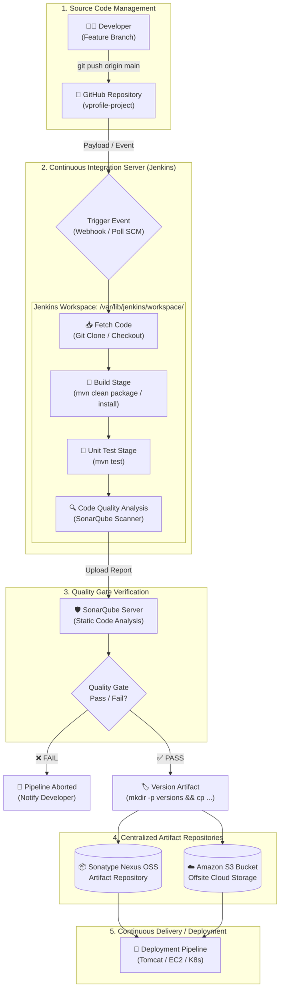
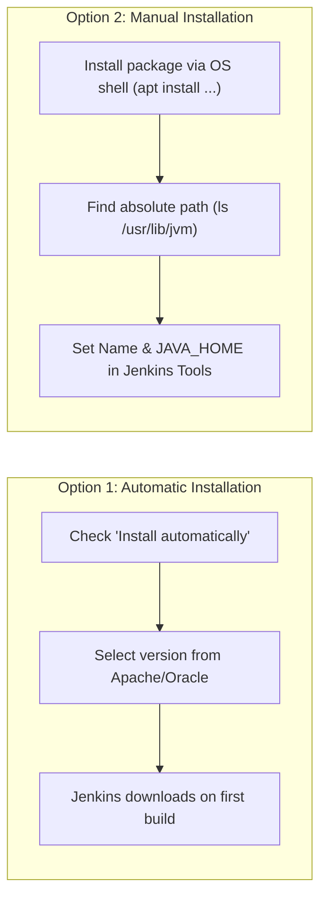
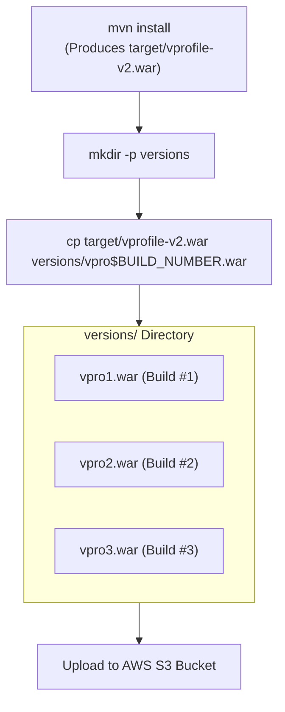
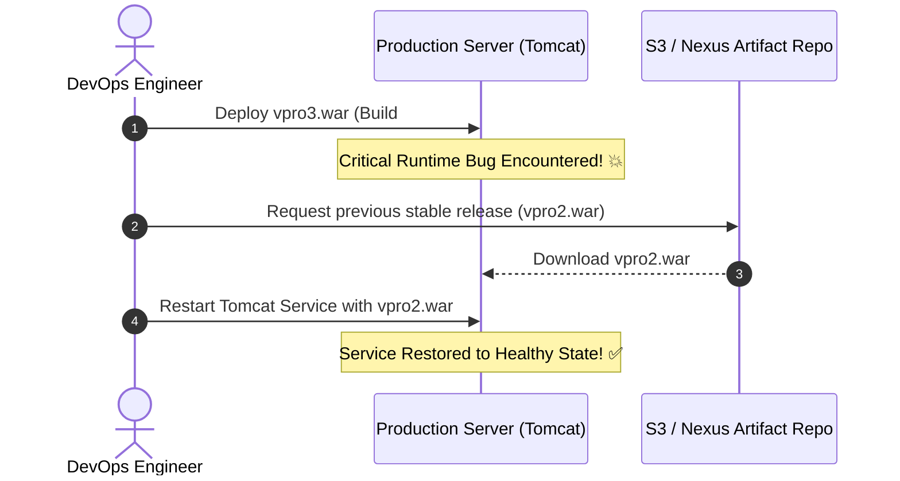

# 🏗️ Continuous Integration & Delivery with Jenkins (CI Master Guide)

Welcome to the definitive guide on **Continuous Integration (CI) and Continuous Delivery (CD)** using Jenkins, Git, Maven, SonarQube, Nexus, and AWS S3. 

This guide is structured to help you understand the end-to-end architecture, tool configurations, artifact versioning strategies, and interview-ready concepts with clear visual diagrams.

---

## 📑 Table of Contents
1. [End-to-End CI Architecture & Workflow](#-end-to-end-ci-architecture--workflow)
2. [Flow of CI Pipeline (Step-by-Step Breakdown)](#-flow-of-ci-pipeline-step-by-step-breakdown)
   - [Stage 1: Developer to GitHub (Source Code)](#1-developer--github-source-code)
   - [Stage 2: GitHub to Jenkins (Triggers)](#2-github--jenkins-triggers)
   - [Stage 3: Fetch Code (Git Checkout & Workspace)](#3-step-1--fetch-code)
   - [Stage 4: Build Application (Maven & pom.xml)](#4-step-2--build-application)
   - [Stage 5: Unit Testing (Fail-Fast Verification)](#5-step-3--unit-testing)
   - [Stage 6: Code Quality Analysis & Quality Gate (SonarQube)](#6-step-4--code-analysis--quality-gate)
   - [Stage 7: Artifact Packaging & Upload (Nexus Repository)](#7-step-5--upload-artifact-to-nexus)
   - [Continuous Integration vs Continuous Delivery/Deployment](#8-where-ci-ends-and-cd-begins)
3. [Jenkins Installation & Tool Configuration](#-jenkins-installation--tool-configuration)
   - [Server Setup & Security Groups](#1-server-setup--networking)
   - [Remote Access via SSH](#2-remote-server-access-via-ssh)
   - [Jenkins Filesystem Layout (`/var/lib/jenkins`)](#3-jenkins-home-directory-structure)
   - [Initial Admin Password & First Login](#4-initial-administrator-password)
   - [Global Tool Configuration (`Manage Jenkins → Tools`)](#5-manage-jenkins--tools)
   - [JDK Installation & `JAVA_HOME` Configuration](#6-jdk-configuration--java_home)
   - [Maven Configuration](#7-maven-configuration)
   - [Git & Other Build Tools (NodeJS, Gradle, Ant)](#8-git-and-other-tools)
4. [Jenkins Plugins, Environment Variables & Versioning](#-jenkins-plugins-environment-variables--artifact-versioning)
   - [Jenkins Plugins Ecosystem](#1-jenkins-plugins)
   - [Essential Plugins Index](#2-essential-plugins)
   - [Built-in Environment Variables](#3-jenkins-environment-variables)
   - [Artifact Versioning Strategy](#4-artifact-versioning-strategy)
   - [Shell Commands for Artifact Management](#5-commands-used-for-versioning)
   - [`$BUILD_NUMBER` vs Custom `$VERSION`](#6-build_number-vs-version)
   - [Why S3 is Used for Offsite Artifact Storage](#7-external-artifact-storage-with-amazon-s3)
   - [Artifacts & Rollback Mechanism](#8-artifacts-and-instant-rollback)
5. [Quick Memory Formulas & Cheat Sheet](#-quick-memory-formulas--cheat-sheet)
6. [Top Interview Questions & Answers](#-top-interview-questions--answers)
7. [Repository References](#-repository-references)

---

## 🏛️ End-to-End CI Architecture & Workflow

Continuous Integration is the practice of automating the integration of code changes from multiple contributors into a single software project. The pipeline below illustrates the journey of source code transformed into a deployable, tested, quality-checked, and versioned artifact.

### Visual Architecture Diagram (Mermaid)



### Text & ASCII Flowchart

```text
                  DEVELOPER
                      │
                      │ git push
                      ▼
                   GITHUB
                      │
                      │ webhook / polling
                      ▼
                   JENKINS
                      │
                      ▼
               ┌──────────────┐
               │  Fetch Code  │  ==> Git
               └──────┬───────┘
                      │
                      ▼
               ┌──────────────┐
               │    Build     │  ==> Maven (mvn clean package / install)
               └──────┬───────┘
                      │
                      ▼
               ┌──────────────┐
               │  Unit Test   │  ==> Maven (mvn test)
               └──────┬───────┘
                      │
                      ▼
               ┌──────────────┐
               │ Code Analysis│  ==> SonarQube
               └──────┬───────┘
                      │
                Quality Gate
                 PASS / FAIL
                      │
           ┌──────────┴──────────┐
           ▼                     ▼
        [ FAIL ]              [ PASS ]
           │                     │
           ▼                     ▼
      STOP & NOTIFY       ┌──────────────┐
                          │Package/Upload│  ==> Nexus OSS / AWS S3
                          │   Artifact   │
                          └──────┬───────┘
                                 │
                                 ▼
                         CONTINUOUS DELIVERY /
                         DEPLOYMENT PIPELINE
```

---

## 🔄 Flow of CI Pipeline (Step-by-Step Breakdown)

The CI lifecycle follows a rigorous progression ensuring that broken code is halted before reaching production environments.

### 1. Developer → GitHub (Source Code)
* Developers write application code, test locally, and push changes to GitHub:
  ```bash
  git add .
  git commit -m "Implement user authentication module"
  git push origin main
  ```
* GitHub serves as the **Single Source of Truth** for source code (Java files, `pom.xml`, properties, HTML templates).

### 2. GitHub → Jenkins (Triggers)
Jenkins connects to GitHub to initiate automated runs using two primary triggering strategies:
| Trigger Mechanism | How It Works | Latency / Efficiency |
|---|---|---|
| **Webhook (Recommended)** | GitHub instantly sends an HTTP POST payload to Jenkins (`http://<jenkins-ip>:8080/github-webhook/`) upon every `git push`. | Instantaneous (zero delay), low resource usage. |
| **Poll SCM** | Jenkins schedules periodic checks (e.g. every 5 or 15 minutes) asking GitHub if new commits exist. | Polling delay, slight resource overhead on both servers. |

---

### 3. Step 1 — Fetch Code
* **Tool:** Git (`git checkout` / `git clone`)
* Jenkins receives the event, provisions an executor, and checks out the designated branch into the **Jenkins Workspace**:
  ```text
  /var/lib/jenkins/workspace/<job-name>/
  ```
* **Workspace Contents:**
  ```text
  <job-workspace>/
  ├── pom.xml
  ├── src/
  │   ├── main/java/
  │   └── test/java/
  └── README.md
  ```

---

### 4. Step 2 — Build Application
* **Tool:** Apache Maven
* **Command:** `mvn clean package` or `mvn install`
* Maven reads the Project Object Model configuration file (`pom.xml`):
  * Downloads required external library dependencies from Maven Central into local repository (`~/.m2/repository`).
  * Compiles `.java` source files into bytecode (`.class` files in `target/classes`).
  * Packages the application into the specified archive format (`.war` for Web Applications, `.jar` for Java Libraries).
* For the **vprofile-project**, Maven creates:
  ```text
  target/vprofile-v2.war
  ```

---

### 5. Step 3 — Unit Testing
* **Tool:** Maven (`mvn test` / Surefire Plugin)
* Executes isolated test cases validating business logic functions.
* **Why Test Before Continuing?**
  ```text
  Code Change ──> Compile ──> Unit Test [FAIL ❌] ──> ABORT PIPELINE
  ```
  If a unit test fails, the build halts immediately (**Fail-Fast Principle**). Defective logic is prevented from propagating further.

---

### 6. Step 4 — Code Analysis & Quality Gate
* **Tool:** SonarQube Scanner + SonarQube Server
* SonarQube performs **Static Code Analysis** (inspecting code without executing it).
* **Key Checks:**
  1. **Bugs:** Flaws that could cause application crash or incorrect calculations.
  2. **Vulnerabilities:** Security holes (e.g., SQL injections, hardcoded credentials).
  3. **Code Smells:** Maintainability issues, dead code, duplicated logic.
  4. **Code Coverage:** Percentage of codebase executed by automated tests.

#### Unit Test vs SonarQube Comparison

| Feature | Unit Testing (`mvn test`) | SonarQube Code Analysis |
|---|---|---|
| **Core Question** | *"Does the code behave functionally as expected?"* | *"Is the code maintainable, secure, and clean?"* |
| **Execution** | Dynamic (executes methods in runtime). | Static (analyzes AST & source code text). |
| **Output** | Pass / Fail test assertions. | Quantitative quality metrics & technical debt. |

#### The Quality Gate Checkpoint
The **Quality Gate** enforces a pass/fail condition:
```text
SonarQube Analysis ──> Evaluate Against Quality Gate ──> PASS: Proceed to Artifact Stage
                                                    ──> FAIL: Block Pipeline Execution
```

---

### 7. Step 5 — Upload Artifact to Nexus
* **Tool:** Sonatype Nexus OSS
* Once build, tests, and quality analysis succeed, the packaged artifact (`vprofile-v2.war`) is uploaded to a centralized **Artifact Repository**.
* Nexus stores versioned binary artifacts:
  ```text
  Nexus Hosted Repository (maven-releases)
  ├── vprofile/2.1/vprofile-2.1.war
  ├── vprofile/2.2/vprofile-2.2.war
  └── vprofile/2.3/vprofile-2.3.war
  ```

#### Source Code Repository vs Artifact Repository

| Property | GitHub (Source Code Repo) | Nexus / S3 (Artifact Repo) |
|---|---|---|
| **What It Stores** | Human-readable text files (`.java`, `.xml`, `.py`, `.sh`). | Pre-compiled binary deliverables (`.war`, `.jar`, `.tar.gz`, Docker images). |
| **Users** | Software Developers & Reviewers. | Deploy bots, servers, and runtime environments. |
| **Size & History** | Small diffs and commit hashes. | Large versioned binaries ready for execution. |

---

### 8. Where CI Ends and CD Begins

```text
Continuous Integration (CI):
Code Commit  ──>  Build  ──>  Unit Test  ──>  Static Analysis  ──>  Artifact Stored (Nexus/S3)
                                                                            │
────────────────────────────────────────────────────────────────────────────┼───────────────
Continuous Delivery / Deployment (CD):                                      ▼
Artifact Retrieved  ──>  Deploy to Staging  ──>  Integration Test  ──>  Deploy to Production
```
> **Remember:** CI is about ensuring code builds, passes tests, and produces a healthy artifact. CD is about delivering that healthy artifact to staging and production servers!

---

## ⚙️ Jenkins Installation & Tool Configuration

### 1. Server Setup & Networking
Jenkins is typically deployed on an Ubuntu Linux server (such as an AWS EC2 instance).

* **Default Port:** `8080`
* **Access URL:** `http://<SERVER_PUBLIC_IP>:8080`
* **AWS EC2 Security Group Rule:**
  * Type: `Custom TCP`
  * Port Range: `8080`
  * Source: `0.0.0.0/0` (or restricted to office/home IP)

---

### 2. Remote Server Access via SSH
Connect to your cloud instance from your local workstation:

```bash
# General Syntax
ssh -i <path-to-private-key.pem> ubuntu@<SERVER-PUBLIC-IP>

# Example from training
ssh -i Downloads/Jenkins-serverkey.pem ubuntu@44.202.22.36

# Elevate to root privileges
sudo -i
```

---

### 3. Jenkins Home Directory Structure
Jenkins stores its data, jobs, plugins, and configurations under:

```text
/var/lib/jenkins/
```

Verify directory contents:
```bash
ls -la /var/lib/jenkins/
```

| Directory / File | Description |
|---|---|
| `/var/lib/jenkins/jobs/` | Contains project configs, build history, and job logs. |
| `/var/lib/jenkins/plugins/` | Contains installed `.jpi` and `.hpi` plugin binaries. |
| `/var/lib/jenkins/secrets/` | Contains encryption keys and `initialAdminPassword`. |
| `/var/lib/jenkins/users/` | User database and account credentials. |
| `/var/lib/jenkins/workspace/` | Working directories where Jenkins jobs check out code and build. |
| `/var/lib/jenkins/config.xml` | Global configuration file for Jenkins controller. |

---

### 4. Initial Administrator Password
On initial setup, Jenkins creates a secure temporary password:

```bash
cat /var/lib/jenkins/secrets/initialAdminPassword
```
*Example output:* `ff05cfd8de5a45a6bb7c870a92302d7d`

Copy and paste this into the web browser setup wizard at `http://<SERVER-IP>:8080`.

---

### 5. Manage Jenkins → Tools
Navigate to:
```text
Jenkins Dashboard ──> Manage Jenkins ──> Tools
```
Jenkins needs to know the exact paths to development runtimes and build engines. You can configure:
- **JDK installations**
- **Maven installations**
- **Git installations**
- **NodeJS installations**
- **Gradle & Ant installations**

#### Automatic vs Manual Installation



---

### 6. JDK Configuration & `JAVA_HOME`

#### Installing OpenJDK 17 on Ubuntu
```bash
# Update package list and install JDK 17
apt update
apt install openjdk-17-jdk -y

# Verify currently active Java runtime
java -version
```

#### Multiple Java Versions & Locating JDK Directory
Linux systems can maintain multiple JDK versions simultaneously.
```bash
ls -la /usr/lib/jvm/
```
*Output:*
```text
java-1.17.0-openjdk-amd64
java-17-openjdk-amd64       <=== Real JDK 17 Installation Directory
openjdk-17
java-1.21.0-openjdk-amd64
java-21-openjdk-amd64
```

#### Configuring in Jenkins UI
1. **Name:** `JDK17`
2. **Uncheck:** `Install automatically`
3. **JAVA_HOME:** `/usr/lib/jvm/java-17-openjdk-amd64`

> [!WARNING]
> **Common Mistake:** Providing `/usr/local/jvm` or `/usr/bin/java`. Jenkins will show an error: *"`/usr/local/jvm doesn't look like a JDK directory`"*. `JAVA_HOME` must point to the root directory containing the `bin/`, `lib/`, and `include/` folders!

---

### 7. Maven Configuration
1. Navigate to **Maven installations** ➔ **Add Maven**.
2. **Name:** `MAVEN3.9`
3. **Option A (Automatic):** Check *Install automatically* ➔ *Install from Apache* ➔ Select version `3.9.x`.
4. **Option B (Manual):** Install `apt install maven -y` and set `MAVEN_HOME` to `/usr/share/maven`.

In your build jobs, simply select `MAVEN3.9` from the dropdown list.

---

### 8. Git and Other Tools
* **Git:** Verify using `git --version`. In Jenkins Tools, default `git` will resolve to `/usr/bin/git`.
* **NodeJS:** Configured for frontend builds (React, Angular, Next.js).
* **Gradle / Ant:** Configured for legacy or specialized Java/Android build tasks.

---

## 🧩 Jenkins Plugins, Environment Variables & Artifact Versioning

### 1. Jenkins Plugins
A plugin is an extension module that equips Jenkins with capabilities to integrate with external systems, cloud providers, and toolchains.

**Plugin Management Menu:**
```text
Dashboard ──> Manage Jenkins ──> Plugins
```
- **Updates:** Shows available updates for installed plugins.
- **Available plugins:** Search and install new plugins from the update center.
- **Installed plugins:** View, enable, disable, or uninstall existing plugins.
- **Advanced settings:** Configure HTTP proxy, upload `.hpi` files manually, or customize update centers.
- **Download progress:** Track live installation status.

---

### 2. Essential Plugins
| Plugin Name | Primary Functionality | Use Case in CI/CD |
|---|---|---|
| **Copy Artifact Plugin** | Copies artifacts generated by one job into another downstream job. | Transfer `.war` from Build Job into Deployment Job. |
| **S3 Publisher Plugin** | Uploads build artifacts directly into an Amazon S3 Bucket. | Cloud archiving and cross-region deployment storage. |
| **AWS SDK Plugin** | Provides core Amazon Web Services API libraries for Jenkins. | Prerequisite for AWS/S3 integration plugins. |
| **SSH Server Plugin** | Enables SSH communication with remote Linux servers. | Remote server deployments and command execution. |
| **Command Agent Launcher** | Launches remote worker nodes (agents) via command line / SSH. | Distributed build infrastructure. |
| **Oracle Java SE Installer**| Automates downloading and installing specific Oracle JDKs. | Environment standardization across agents. |
| **Build Timestamp Plugin** | Injects custom date/time formats into build logs and artifact names. | Versioning: `vprofile-20260919-build4.war`. |

---

### 3. Jenkins Environment Variables
Jenkins injects valuable context metadata into every build shell session:

| Variable | Definition | Example Value |
|---|---|---|
| `$BUILD_NUMBER` | Monotonically increasing sequential build count | `1`, `2`, `3`, `42` |
| `$BUILD_ID` | Timestamp/unique ID of the current build execution | `2026-09-19_12-30-00` |
| `$JOB_NAME` | Name of the current Jenkins project | `vprofile-ci-pipeline` |
| `$WORKSPACE` | Absolute path to the checked-out workspace directory | `/var/lib/jenkins/workspace/vprofile-ci` |
| `$NODE_NAME` | Name of the worker agent node running the build (`master`/`agent-1`) | `built-in` |
| `$EXECUTOR_NUMBER`| ID of the specific executor slot running the task | `0` or `1` |
| `$JAVA_HOME` | Directory pointing to the active Java SDK | `/usr/lib/jvm/java-17-openjdk-amd64` |
| `$JENKINS_URL` | Base HTTP endpoint of the Jenkins controller | `http://44.202.22.36:8080/` |

---

### 4. Artifact Versioning Strategy
When Maven compiles the VProfile project, it continuously generates:
```text
target/vprofile-v2.war
```
If every build produces the exact same file name:
- **Build #1** overwrites previous test builds.
- **Build #2** overwrites Build #1.
- If **Build #3** has a critical bug in production, you have **no way to roll back** to Build #2 without rebuilding source code!

#### The Versioning Solution



---

### 5. Commands Used for Versioning

Inside Jenkins **Build Steps ➔ Execute shell**:

```bash
# 1. Compile, test, and package application
mvn clean install

# 2. Create the versions directory if it does not exist
mkdir -p versions

# 3. Copy with unique build number versioning
cp target/vprofile-v2.war versions/vpro$BUILD_NUMBER.war
```

#### Command Breakdown:
* `mkdir -p versions`:
  * `mkdir`: Create directory.
  * `-p` (`--parents`): Do not throw an error if directory already exists; create parent directories if needed.
* `cp target/vprofile-v2.war versions/vpro$BUILD_NUMBER.war`:
  * Source: `target/vprofile-v2.war`
  * Destination: `versions/vpro$BUILD_NUMBER.war` (evaluates to `versions/vpro1.war`, `versions/vpro2.war`, etc.)

---

### 6. `$BUILD_NUMBER` vs `$VERSION`

| Feature | `$BUILD_NUMBER` | Custom `$VERSION` |
|---|---|---|
| **Origin** | Automatically managed by Jenkins. | Defined as a **Build Parameter** or Project Environment Variable. |
| **Format** | Incrementing integer (`1`, `2`, `3`). | Semantic versioning (`2.3.6`, `v1.0.4-rc`). |
| **Command** | `cp target/app.war versions/vpro$BUILD_NUMBER.war` | `cp target/app.war versions/vpro$VERSION.war` |
| **Result** | `vpro3.war` | `vpro2.3.6.war` |

---

### 7. External Artifact Storage with Amazon S3

Instead of keeping build artifacts solely on the local Jenkins server disk:
```text
Jenkins Master Disk ──> Subject to disk exhaustion & server crash data loss
```
Jenkins uploads artifacts to **Amazon S3**:
```text
Jenkins Server ──> Build & Version Artifact ──> S3 Publisher Plugin ──> AWS S3 Bucket
```

#### Advantages of Storing Artifacts in S3 / Nexus:
1. **Durable & Resilient:** 99.999999999% (11 9's) durability on S3; unaffected if Jenkins controller instance is terminated.
2. **Centralized Access:** Staging and Production deployment scripts across multiple AWS regions can fetch the artifact directly from S3 or Nexus.
3. **Disk Space Optimization:** Prevents Jenkins server from filling up `/var/lib/jenkins` disk space with heavy archives.

---

### 8. Artifacts and Instant Rollback

Artifact versioning provides an instant **Rollback Mechanism**:



> **Crucial Distinction:** The artifact repository itself does not automatically trigger the rollback. Rather, it **preserves the deployable version**, making fast, risk-free rollbacks possible without recompiling old Git commits!

---

## ⚡ Quick Memory Formulas & Cheat Sheet

### 1. The CI Pipeline Stages: **F ➔ B ➔ T ➔ A ➔ U**
* **F** = **Fetch** (Git)
* **B** = **Build** (Maven)
* **T** = **Test** (Unit Test / Surefire)
* **A** = **Analyze** (SonarQube)
* **U** = **Upload** (Nexus / S3)

### 2. Jenkins Variables at a Glance:
```text
BUILD       ──> Which build?        ($BUILD_NUMBER, $BUILD_ID)
JOB         ──> Which job?          ($JOB_NAME)
WORKSPACE   ──> Where on disk?      ($WORKSPACE)
NODE        ──> Which server node?  ($NODE_NAME)
EXECUTOR    ──> Which thread/slot?  ($EXECUTOR_NUMBER)
JAVA_HOME   ──> Which Java?         ($JAVA_HOME)
JENKINS_URL ──> Which server URL?   ($JENKINS_URL)
```

### 3. Essential Command Reference:
```bash
# Server access
ssh -i <key.pem> ubuntu@<SERVER-IP>
sudo -i

# Inspect Jenkins installation
ls -la /var/lib/jenkins/
cat /var/lib/jenkins/secrets/initialAdminPassword

# Java & Tool discovery
apt update && apt install openjdk-17-jdk -y
java -version
ls -la /usr/lib/jvm/
git --version

# Artifact versioning inside Build Step
mvn clean install
mkdir -p versions
cp target/vprofile-v2.war versions/vpro$BUILD_NUMBER.war
```

---

## 🎯 Top Interview Questions & Answers

### Q1: Why do we configure tools under Manage Jenkins ➔ Tools?
> **Answer:** Jenkins needs to know the exact installation path and version of build tools (JDK, Maven, Git, NodeJS) so that individual jobs can use specific, compatible runtimes without relying on system-level defaults.

---

### Q2: What is `JAVA_HOME` and why does Jenkins require it?
> **Answer:** `JAVA_HOME` is an environment variable pointing to the root directory where the Java Development Kit (JDK) is installed (e.g. `/usr/lib/jvm/java-17-openjdk-amd64`). It is needed so Maven and Jenkins plugins can compile and run Java applications using the correct JDK libraries.

---

### Q3: What is the difference between Unit Testing and SonarQube Code Analysis?
> **Answer:** Unit tests (`mvn test`) verify functional correctness (whether business logic produces expected outputs). SonarQube performs static analysis without running the code to detect bugs, security vulnerabilities, architectural code smells, and check compliance with Quality Gates.

---

### Q4: Why do we store artifacts in Nexus or Amazon S3 instead of leaving them in the Jenkins workspace?
> **Answer:**
> 1. Jenkins workspaces are temporary and easily wiped during clean builds.
> 2. Leaving large binary files on Jenkins exhausts server disk space.
> 3. Nexus and S3 provide centralized, durable, and highly available storage accessible to multi-region deployment pipelines.

---

### Q5: How does artifact versioning support production rollback?
> **Answer:** By saving each build's output with unique identifiers (e.g., `vpro$BUILD_NUMBER.war` or `vpro$VERSION.war`), earlier stable artifacts are preserved. If a deployment fails, teams can instantly deploy the prior known-good artifact without needing to re-compile or re-test older Git commits.

---

### Q6: Where is the initial administrator password stored in Jenkins?
> **Answer:** `/var/lib/jenkins/secrets/initialAdminPassword`

---

## 🔗 Repository References
- 📂 [Dedicated CI Knowledge Base Folder (`ci/`)](../ci/README.md)
- 📊 [CI Pipeline Visual Diagrams (`ci/diagrams/`)](../ci/diagrams/ci-flow.md)
- ⚙️ [Jenkins Guides (`ci/jenkins/`)](../ci/jenkins/installation-guide.md)
- 🧪 [Sample Console Log Diagnostics (`jenkins.txt`)](./jenkins.txt)
