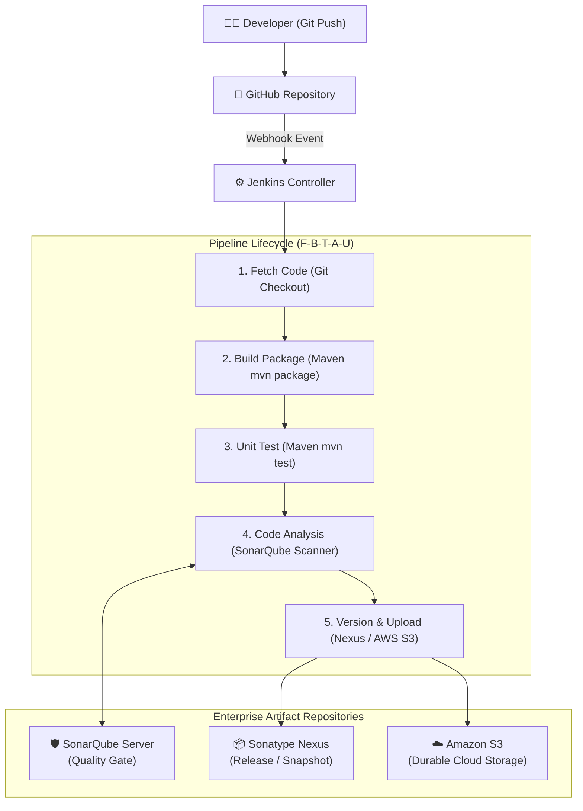

# 🏗️ DevOps Begins — Continuous Integration (`ci` Branch)

Welcome to the `ci` branch of **DevOps Begins**! This branch houses the complete **Continuous Integration (CI) & Delivery Knowledge Base**, hands-on freestyle projects, pipeline-as-code implementations, and architecture diagrams.

---

## 🧭 Repository Structure on `ci` Branch

```text
Devop-Begins (ci branch)
├── 06-CI-and-Delivery-w-jenkins/        # 📖 Master CI/CD Module Guide (All-in-One Documentation)
│   ├── README.md                        # Exhaustive guide: Flow, Installation, Tools, Plugins, S3
│   └── jenkins.txt                      # Console output diagnostics reference
│
├── ci/                                  # 🏛️ Dedicated DevOps CI Knowledge Base
│   ├── README.md                        # Navigation hub and learning roadmap
│   ├── diagrams/                        # Visual architecture & sequence diagrams
│   │   └── ci-flow.md                   # Mermaid & ASCII flowcharts (F-B-T-A-U)
│   ├── jenkins/                         # In-depth Jenkins administration guides
│   │   ├── installation-and-tools.md    # EC2, SSH, /var/lib/jenkins, JDK 17, JAVA_HOME, Maven 3.9
│   │   └── plugins-versioning-artifacts.md # Plugins, Env Vars ($BUILD_NUMBER), S3 storage, Rollback
│   └── notes/                           # Topic-by-topic revision sheets & Interview Q&A
│       ├── ci-pipeline-flow-notes.md    # Stage-by-stage lecture notes
│       ├── jenkins-tools-setup-notes.md # Tool setup lecture notes
│       ├── plugins-and-versioning-notes.md # Versioning & S3 lecture notes
│       └── interview-qa.md              # Curated top interview questions & answers
│
├── freestyle-build-foundation/          # 🔨 Hands-on Jenkins Freestyle build project
└── pipeline-as-code-mastery/            # 📜 Advanced multi-stage Jenkinsfile pipeline project
```

---

## 🚀 The Complete CI Pipeline Architecture



---

## ⚡ Key Highlights & Formula

* **The CI Lifecycle Formula:** **F ➔ B ➔ T ➔ A ➔ U**
  * **F**etch (Git)
  * **B**uild (Maven)
  * **T**est (Unit Testing)
  * **A**nalyze (SonarQube Quality Gate)
  * **U**pload (Nexus OSS / AWS S3)
* **Tool Configuration:** Configured under `Manage Jenkins → Tools` (OpenJDK 17, `JAVA_HOME = /usr/lib/jvm/java-17-openjdk-amd64`, Apache Maven 3.9).
* **Artifact Versioning:** `mkdir -p versions && cp target/vprofile-v2.war versions/vpro$BUILD_NUMBER.war`.
* **Zero-Rebuild Rollback:** Preserving build binaries in S3/Nexus allows immediate deployment of earlier stable releases (`vpro2.war`) without recompiling older Git code.

---

## 🔗 Direct Guide Links

* 📘 [Master CI/CD Module Guide](./06-CI-and-Delivery-w-jenkins/README.md)
* 📊 [CI Pipeline Flow & Diagrams](./ci/diagrams/ci-flow.md)
* 🛠️ [Jenkins Installation & Tool Configuration Guide](./ci/jenkins/installation-and-tools.md)
* 🧩 [Jenkins Plugins, Versioning & S3 Storage Guide](./ci/jenkins/plugins-versioning-artifacts.md)
* 🎯 [Top Interview Questions & Answers](./ci/notes/interview-qa.md)
