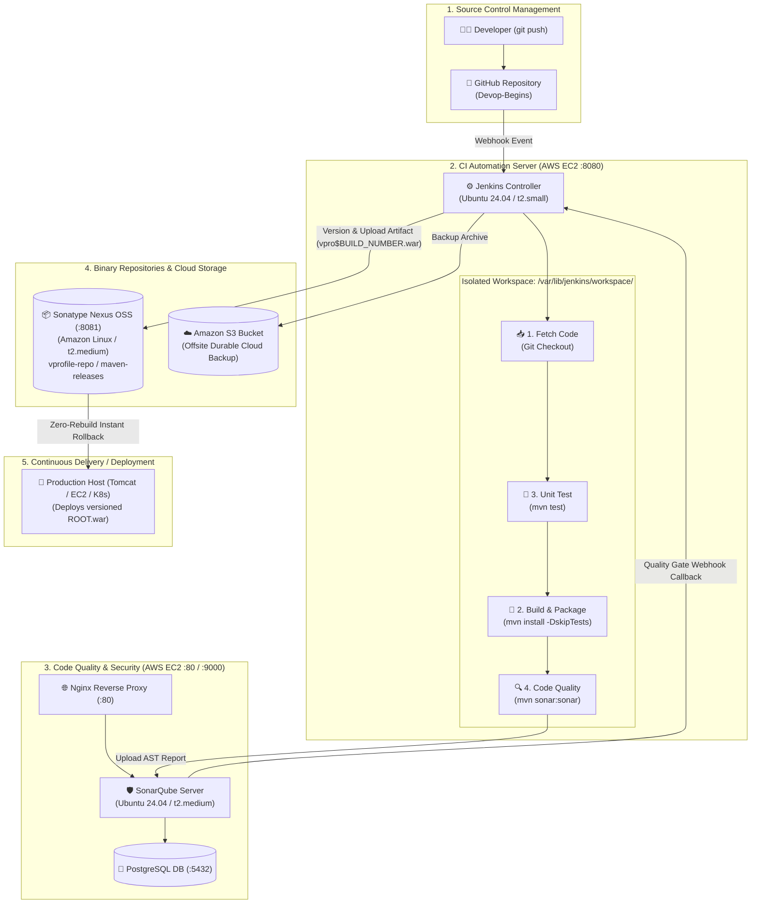

# 🚀 DevOps Begins — The Master Technical Knowledge Base


Welcome to **DevOps Begins**, an enterprise-grade, comprehensive, and searchable technical knowledge base and personal reference memory for modern DevOps, Cloud Engineering, CI/CD, and Site Reliability Engineering (SRE).

---

## 🧭 Master Quick Navigation

| Central Indexes & Maps | Purpose |
|---|---|
| 🗺️ **[Learning Roadmap](./ROADMAP.md)** | Step-by-step phased engineering progression path from Linux to Cloud Orchestration. |
| 📊 **[Learning Progress Tracker](./LEARNING_PROGRESS.md)** | Interactive checklist of completed skills, tools, and hands-on laboratory milestones. |
| 📖 **[Master DevOps Glossary](./GLOSSARY.md)** | Comprehensive dictionary of over 50+ DevOps, Cloud, and SRE terms. |

---

## 🏛️ The End-to-End Enterprise CI/CD Architecture



---

## ⚡ The Golden Memory Formula: **F ➔ B ➔ T ➔ A ➔ U**

1. **F**etch ➔ Git checks out the repository branch into `/var/lib/jenkins/workspace/<job>`.
2. **B**uild ➔ Apache Maven compiles and packages application bytecode.
3. **T**est ➔ Automated unit test assertions execute via `mvn test` (Fail-fast principle).
4. **A**nalyze ➔ SonarQube scans bugs, security vulnerabilities, code smells, and evaluates the Quality Gate.
5. **U**pload ➔ Packaged binary is versioned (`vpro$BUILD_NUMBER.war`) and published to Nexus OSS and AWS S3.

---

## 📚 Complete Knowledge Base Directory Index (`docs/`)

```text
docs/
├── 00-overview/             # Culture, Pillars, DORA Metrics & Multi-Server Architecture
├── 01-linux/                # Filesystem Hierarchy, Commands, Permissions, Systemd & Storage
├── 02-git/                  # Git Internals, Daily Commands, Branching Models & Conflicts
├── 03-aws/                  # EC2 Sizing, Security Groups, EBS Resizing, IAM & Networking
├── 04-jenkins/              # Architecture, Installation, Freestyle, Pipelines, Jenkinsfile & Security
├── 05-maven/                # POM.xml, GAV Coordinates, Lifecycles, Dependencies & Repositories
├── 06-sonarqube/            # Static Analysis, PostgreSQL, Kernel Tuning, Nginx Proxy & Quality Gates
├── 07-nexus/                # Artifact Management, Hosted/Proxy/Group Repos, Admin Passwords & Jenkins
├── 08-docker/               # Containers vs VMs, Commands, Multi-Stage Builds & Optimization
├── 09-kubernetes/           # Cluster Topology, Control Plane, Pods, Deployments & Services
├── 10-terraform/            # Infrastructure as Code, HCL Syntax, AWS Provider & State Safety
├── 11-ansible/              # Agentless Architecture, YAML Playbooks, Inventories & Idempotency
└── 12-interview-prep/       # Curated Technical Q&A across DevOps, Jenkins, Linux, AWS & Scenarios
```

### Module Guides Breakdown:

#### 🌐 00. DevOps & CI/CD Architecture
* [DevOps Culture, Pillars & DORA Metrics](./docs/00-overview/devops-overview.md)
* [Continuous Integration, Delivery & Deployment Explained](./docs/00-overview/ci-cd-overview.md)
* [End-to-End Enterprise Multi-Server Architecture & Port Mapping](./docs/00-overview/architecture.md)

#### 🐧 01. Linux Systems Administration
* [Linux Fundamentals & Filesystem Hierarchy Standard (FHS)](./docs/01-linux/basics.md)
* [Essential Linux Commands (Inspection, Storage, Network, Processes)](./docs/01-linux/commands.md)
* [Permissions, Ownership & Sudo inside Non-Interactive Jenkins](./docs/01-linux/permissions.md)
* [Systemd Service Management, Unit Files & Journalctl](./docs/01-linux/systemd.md)
* [Linux Troubleshooting & Storage Diagnostic Runbook](./docs/01-linux/troubleshooting.md)

#### 🐙 02. Version Control with Git
* [Git Fundamentals & Internal Object Model (Blobs, Trees, Commits)](./docs/02-git/basics.md)
* [Essential Git Daily Commands Reference](./docs/02-git/commands.md)
* [Branching Strategies: GitFlow, Trunk-Based & Ref Naming Rules](./docs/02-git/branching.md)
* [Git Troubleshooting & Merge Conflict Resolution](./docs/02-git/troubleshooting.md)

#### ☁️ 03. Amazon Web Services (AWS)
* [AWS Core Services Overview & Cost Precautions](./docs/03-aws/overview.md)
* [Amazon EC2 Server Provisioning & Instance Sizing Rationale](./docs/03-aws/ec2.md)
* [Security Groups: Stateful Rules & SG-to-SG Architecture](./docs/03-aws/security-groups.md)
* [AWS EBS Volume Management & Filesystem Resizing Walkthrough](./docs/03-aws/ebs.md)
* [AWS IAM Roles & Instance Profiles vs Dangerous Hardcoded Keys](./docs/03-aws/iam.md)
* [AWS Networking: VPC, Subnets, Routing & Private IP Communication](./docs/03-aws/networking.md)
* [AWS Cloud Troubleshooting & Connection Failure Runbook](./docs/03-aws/troubleshooting.md)

#### ⚙️ 04. Jenkins Automation Server
* [Jenkins Architecture: Controller vs Distributed Agents](./docs/04-jenkins/overview.md)
* [Jenkins Installation on Ubuntu 24.04 & Global Tool Configuration](./docs/04-jenkins/installation.md)
* [Jenkins Freestyle Projects: Complete Configuration Deep-Dive](./docs/04-jenkins/freestyle.md)
* [Pipeline as Code Concepts & Groovy Sandbox Mechanics](./docs/04-jenkins/pipeline.md)
* [Master Jenkinsfile Syntax & Multi-Stage Declarative Architecture](./docs/04-jenkins/jenkinsfile.md)
* [Jenkins Plugins Ecosystem & Security Precautions](./docs/04-jenkins/plugins.md)
* [Jenkins Credentials Store & Token Masking](./docs/04-jenkins/credentials.md)
* [Distributed Build Agents & Ephemeral Docker Runners](./docs/04-jenkins/agents.md)
* [Artifact Versioning Strategies & Zero-Rebuild Rollbacks](./docs/04-jenkins/artifacts.md)
* [Built-in Environment Variables & Parameterized Builds](./docs/04-jenkins/environment-variables.md)
* [Jenkins Troubleshooting & Diagnostic Runbook](./docs/04-jenkins/troubleshooting.md)
* [Jenkins Security Hardening & The 10 Commandments](./docs/04-jenkins/security.md)

#### 🔨 05. Apache Maven Build Tool
* [Maven Overview & Standard Directory Conventions](./docs/05-maven/overview.md)
* [Project Object Model (`pom.xml`), Coordinates (GAV) & Scopes](./docs/05-maven/pom-xml.md)
* [Build Lifecycles, Phases & Why `-DskipTests` Is Used in CI](./docs/05-maven/lifecycle-and-goals.md)
* [Maven Repositories: Local Cache, Central & Nexus Mirror](./docs/05-maven/repositories.md)
* [Maven Troubleshooting & Dependency Resolution Errors](./docs/05-maven/troubleshooting.md)

#### 🔍 06. SonarQube Code Quality Platform
* [SonarQube Static Analysis vs Dynamic Unit Testing](./docs/06-sonarqube/overview.md)
* [SonarQube Installation, Kernel Tuning & PostgreSQL Backend](./docs/06-sonarqube/installation.md)
* [Quality Gates & "Clean as You Code" Methodology](./docs/06-sonarqube/quality-gates.md)
* [Jenkins & SonarQube End-to-End Webhook Integration](./docs/06-sonarqube/jenkins-integration.md)
* [Nginx Reverse Proxy Setup for SonarQube on Port 80](./docs/06-sonarqube/nginx-proxy.md)
* [SonarQube Troubleshooting & Elasticsearch Fixes](./docs/06-sonarqube/troubleshooting.md)

#### 📦 07. Sonatype Nexus OSS
* [Sonatype Nexus OSS Overview & Enterprise Benefits](./docs/07-nexus/overview.md)
* [Nexus Installation on Amazon Linux 2023 with Corretto 17](./docs/07-nexus/installation.md)
* [Repository Types: Hosted (Releases/Snapshots), Proxy & Group](./docs/07-nexus/repository-types.md)
* [Jenkins & Nexus End-to-End Pipeline Artifact Upload](./docs/07-nexus/jenkins-integration.md)
* [Nexus Troubleshooting & Upload Error Resolution](./docs/07-nexus/troubleshooting.md)

#### 🐳 08. Docker & Containerization
* [Docker Overview & Containers vs Virtual Machines](./docs/08-docker/overview.md)
* [Essential Docker Commands Reference](./docs/08-docker/commands.md)
* [Dockerfile Architecture & Multi-Stage Image Optimization](./docs/08-docker/dockerfile.md)

#### ☸️ 09. Kubernetes (K8s) Orchestration
* [Kubernetes Overview & Value Proposition](./docs/09-kubernetes/overview.md)
* [Kubernetes Cluster Architecture (Control Plane & Worker Nodes)](./docs/09-kubernetes/architecture.md)
* [Core K8s Workloads: Pods, Deployments & LoadBalancer Services](./docs/09-kubernetes/components.md)

#### 🌍 10. HashiCorp Terraform (IaC)
* [Terraform Overview & Infrastructure as Code Philosophy](./docs/10-terraform/overview.md)
* [Terraform Basics, HCL Syntax & State File Precautions](./docs/10-terraform/basics.md)

#### 📜 11. Ansible Configuration Management
* [Ansible Overview & Agentless Architecture](./docs/11-ansible/overview.md)
* [Ansible Playbooks, Inventory & Jenkins Automation](./docs/11-ansible/playbooks.md)

#### 🎯 12. Technical Interview Preparation
* [DevOps & CI/CD Architectural Interview Questions](./docs/12-interview-prep/devops-questions.md)
* [Top Jenkins Technical Interview Questions & Answers](./docs/12-interview-prep/jenkins-questions.md)
* [Linux Systems Administration Interview Questions](./docs/12-interview-prep/linux-questions.md)
* [AWS Cloud & Security Interview Questions](./docs/12-interview-prep/aws-questions.md)
* [Real-World Scenario-Based Technical Interview Questions](./docs/12-interview-prep/scenario-based.md)

---

## 📂 Active Application Repositories in this Project

This repository preserves hands-on application codebases and provisioning scripts:
* **[06-CI-and-Delivery-w-jenkins/](./06-CI-and-Delivery-w-jenkins/README.md):** Comprehensive module guide and diagnostic log references (`jenkins.txt`).
* **[freestyle-build-foundation/](./freestyle-build-foundation/README.md):** Complete Java Spring MVC application codebase and automated AWS EC2 user-data bash scripts (`userdata/jenkins-setup.sh`, `nexus-setup.sh`, `sonar-setup.sh`).
* **[pipeline-as-code-mastery/](./pipeline-as-code-mastery/README.md):** Multi-tier VProfile enterprise application source code with Vagrant automated provisioning environments.
* **[ci/](./ci/README.md):** Original CI reference documentation, installation scripts, and visual ASCII flowcharts.

---

## 🛠️ Quick Operational Command Cheat Sheet

```bash
# 1. Connect to AWS EC2 Instance via SSH
chmod 400 Jenkins-serverkey.pem
ssh -i Jenkins-serverkey.pem ubuntu@<SERVER-PUBLIC-IP>
sudo -i

# 2. Service Management
sudo systemctl status jenkins
sudo systemctl status nexus
sudo systemctl status sonarqube

# 3. Port Diagnostics
sudo ss -lntp | grep 8080   # Jenkins
sudo ss -lntp | grep 8081   # Nexus
sudo ss -lntp | grep 9000   # SonarQube
sudo ss -lntp | grep 80     # Nginx Proxy

# 4. Storage Diagnostics & Partition Growth
df -h
lsblk
sudo growpart /dev/xvda 1
sudo resize2fs /dev/xvda1   # ext4
sudo xfs_growfs -d /        # xfs

# 5. Local Jenkins Password & Java Discovery
cat /var/lib/jenkins/secrets/initialAdminPassword
java -version
ls -la /usr/lib/jvm/
```
