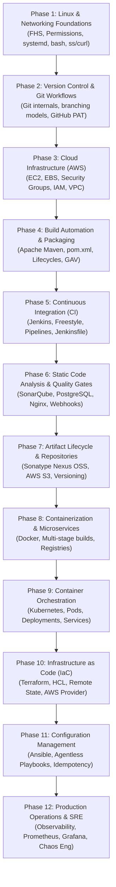

# 🗺️ DevOps Engineer Learning Roadmap & Mastery Path

A comprehensive, phased technical journey from operating system fundamentals to advanced cloud orchestration and automation.

---

## 📈 Visual Progression Path

---

## 🧭 Phase-by-Phase Learning Curriculum

### Phase 1: Linux & Systems Administration
* **Core Concepts:** Filesystem Hierarchy Standard (FHS), permissions (`chmod`, `chown`), user management, process isolation.
* **Service Management:** `systemd`, `systemctl`, `journalctl`.
* **Storage:** Disk inspection (`df -h`, `lsblk`, `fdisk -l`), partition expansion (`growpart`, `resize2fs`, `xfs_growfs`).
* **Documentation Reference:** [Linux Documentation](./docs/01-linux/basics.md)

### Phase 2: Git & Distributed Version Control
* **Core Concepts:** The 3 areas of Git (Working, Staging, Repository), commit SHAs, trees, blobs.
* **Branching Strategies:** GitFlow, Trunk-Based Development, conflict resolution.
* **Documentation Reference:** [Git Documentation](./docs/02-git/basics.md)

### Phase 3: Amazon Web Services (AWS)
* **Compute & Storage:** EC2 instance sizing (`t2.small`, `t2.medium`), EBS volume resizing.
* **Networking & Security:** Security Groups (stateful firewall rules, SG-to-SG rules), VPC, Subnets, Internet Gateways.
* **IAM Security:** Least privilege, IAM Roles & Instance Profiles vs static access keys.
* **Documentation Reference:** [AWS Documentation](./docs/03-aws/overview.md)

### Phase 4: Build Automation with Apache Maven
* **Core Concepts:** Project Object Model (`pom.xml`), coordinates (GroupId, ArtifactId, Version).
* **Build Lifecycles:** `clean`, `default` (compile, test, package, install, deploy).
* **CI Optimization:** Using `-DskipTests` after isolated unit test execution.
* **Documentation Reference:** [Maven Documentation](./docs/05-maven/overview.md)

### Phase 5: Continuous Integration with Jenkins
* **Controller vs Agents:** Master-worker distributed architecture.
* **Job Types:** Freestyle projects vs Pipeline as Code (`Jenkinsfile`).
* **Tool Integration:** Configuring JDK 17 (`JAVA_HOME`) and Maven 3.9 under `Manage Jenkins ➔ Tools`.
* **Credentials & Secrets:** Secure parameter masking in console logs.
* **Documentation Reference:** [Jenkins Documentation](./docs/04-jenkins/overview.md)

### Phase 6: Code Quality with SonarQube
* **Analysis Scope:** Static inspection of Bugs, Vulnerabilities, Security Hotspots, and Code Smells.
* **Host Tuning:** Kernel parameters (`vm.max_map_count=262144`, `fs.file-max=65536`).
* **Database & Proxy:** PostgreSQL 15+ backend, Nginx reverse proxy on port 80.
* **Quality Gate Enforcement:** Webhook integration with Jenkins (`waitForQualityGate`).
* **Documentation Reference:** [SonarQube Documentation](./docs/06-sonarqube/overview.md)

### Phase 7: Artifact Repositories with Sonatype Nexus OSS
* **Repository Architecture:** Hosted (releases/snapshots), Proxy (Maven Central caching), Group (`maven-public`).
* **Artifact Versioning:** Sequential `$BUILD_NUMBER` vs semantic `$VERSION`.
* **Instant Rollbacks:** Zero-rebuild recovery from preserved binaries.
* **Documentation Reference:** [Nexus Documentation](./docs/07-nexus/overview.md)

### Phase 8: Containerization with Docker
* **Core Concepts:** Namespaces, cgroups, images, containers, registries.
* **Dockerfile Optimization:** Multi-stage builds to produce minimal production images (from 1.5 GB down to 150 MB).
* **Documentation Reference:** [Docker Documentation](./docs/08-docker/overview.md)

### Phase 9: Container Orchestration with Kubernetes
* **Architecture:** Control Plane (`kube-apiserver`, `etcd`, `kube-scheduler`, `controller-manager`) and Worker Nodes (`kubelet`, `kube-proxy`, `containerd`).
* **Workloads:** Pods, ReplicaSets, Deployments, Services (ClusterIP, NodePort, LoadBalancer), ConfigMaps, Secrets.
* **Documentation Reference:** [Kubernetes Documentation](./docs/09-kubernetes/overview.md)

### Phase 10: Infrastructure as Code (IaC) with Terraform
* **Core Concepts:** HashiCorp Configuration Language (HCL), providers, resources, variables, outputs.
* **State Management:** `terraform.tfstate`, remote S3 backends, state locking with DynamoDB.
* **Documentation Reference:** [Terraform Documentation](./docs/10-terraform/overview.md)

### Phase 11: Configuration Management with Ansible
* **Core Concepts:** Agentless automation over SSH, YAML syntax, inventory files.
* **Idempotency:** Safe multi-run playbooks for host provisioning.
* **Documentation Reference:** [Ansible Documentation](./docs/11-ansible/overview.md)

### Phase 12: Interview Preparation & Practical Scenarios
* **Core Concepts:** Comprehensive answers to architectural, conceptual, and live troubleshooting questions.
* **Documentation Reference:** [Interview Preparation Guide](./docs/12-interview-prep/devops-questions.md)
