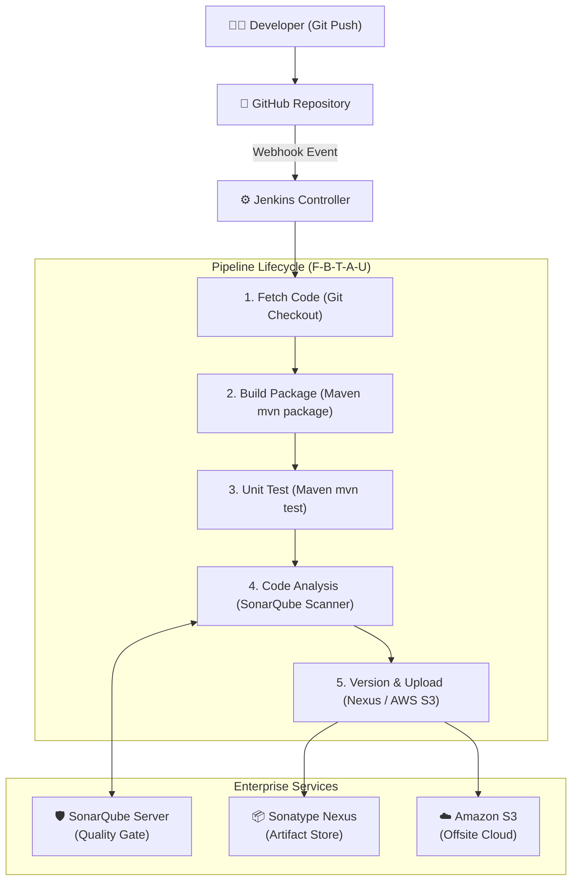

# 🏗️ DevOps CI Learning Architecture & Knowledge Base

Welcome to the `ci` branch of **DevOps Begins**! This branch is dedicated to Continuous Integration (CI), Continuous Delivery (CD), pipeline automation, tool configurations, and artifact lifecycle management.

---

## 🧭 Directory Index

```text
ci/
├── README.md                              # Main knowledge base index (this file)
│
├── diagrams/                              # Visual CI/CD architecture & data flow diagrams
│   └── ci-flow.md                         # Mermaid & ASCII end-to-end CI pipeline maps
│
├── jenkins/                               # In-depth Jenkins administration & configuration guides
│   ├── installation-and-tools.md          # EC2 setup, SSH, initialAdminPassword, JDK 17, Maven 3.9
│   ├── plugins-versioning-artifacts.md    # Plugins, environment variables, S3 publishing, rollback
│   ├── installation-guide.md              # Quick checklist for Jenkins installation
│   ├── setup-guide.md                     # Quick checklist for Jenkins tools setup
│   ├── plugins-guide.md                   # Plugin index reference
│   ├── freestyle-job-guide.md             # Guide for building Freestyle jobs
│   ├── pipeline-job-guide.md              # Guide for Pipeline jobs
│   ├── credentials-guide.md               # Secret and token management
│   └── Jenkinsfile                        # Declarative pipeline template
│
├── notes/                                 # Organized revision notes, lecture summaries & interview Q&A
│   ├── ci-pipeline-flow-notes.md          # Complete notes on the 5-stage CI pipeline
│   ├── jenkins-tools-setup-notes.md       # Notes on Manage Jenkins -> Tools & JDK 17
│   ├── plugins-and-versioning-notes.md    # Notes on plugins, env vars, and S3 versioning
│   └── interview-qa.md                    # Top technical interview questions & answers
│
├── nexus/                                 # Nexus OSS artifact repository documentation
│   ├── installation-guide.md
│   ├── artifact-upload-guide.md
│   └── jenkins-integration.md
│
├── sonarqube/                             # SonarQube static code analysis documentation
│   ├── installation-notes.md
│   ├── configuration-notes.md
│   └── jenkins-integration.md
│
├── examples/                              # Reusable pipeline scripts (Maven, Sonar, Multi-stage)
└── scripts/                               # Shell scripts for automated installation
```

---

## 🚀 The End-to-End CI Pipeline Architecture



---

## ⚡ The Golden Memory Formula: **F ➔ B ➔ T ➔ A ➔ U**

1. **F**etch ➔ Git retrieves the source code into `/var/lib/jenkins/workspace/<job>`.
2. **B**uild ➔ Apache Maven compiles and packages the code into a `.war` or `.jar`.
3. **T**est ➔ Automated unit tests run via `mvn test` (Fail-fast principle).
4. **A**nalyze ➔ SonarQube inspects bugs, security vulnerabilities, and code smells.
5. **U**pload ➔ Packaged binary is versioned (`vpro$BUILD_NUMBER.war`) and published to Nexus OSS or Amazon S3.

---

## 📚 Core Learning Guides

* **[CI Architecture & Flow Diagrams](./diagrams/ci-flow.md)**: Visual flowchart, stage comparisons, and rollback diagrams.
* **[Jenkins Installation & Tools Guide](./jenkins/installation-and-tools.md)**: EC2 setup, port 8080, SSH, `/var/lib/jenkins`, JDK 17, `JAVA_HOME`, and Maven 3.9.
* **[Plugins, Versioning & S3 Storage](./jenkins/plugins-versioning-artifacts.md)**: Copy Artifact, S3 Publisher, built-in environment variables, versioning scripts, and rollback strategies.
* **[Interview Preparation Q&A](./notes/interview-qa.md)**: Comprehensive interview questions covering tool configuration, versioning, quality gates, and artifact management.

---

## 🛠️ Quick Command Reference

```bash
# Connect to Jenkins EC2 Server
ssh -i <key.pem> ubuntu@<SERVER-IP>
sudo -i

# Inspect Jenkins Secrets
cat /var/lib/jenkins/secrets/initialAdminPassword

# Install OpenJDK 17 on Ubuntu
apt update && apt install openjdk-17-jdk -y
java -version
ls -la /usr/lib/jvm/

# Maven build and artifact versioning in Execute Shell
mvn clean install
mkdir -p versions
cp target/vprofile-v2.war versions/vpro$BUILD_NUMBER.war
```
