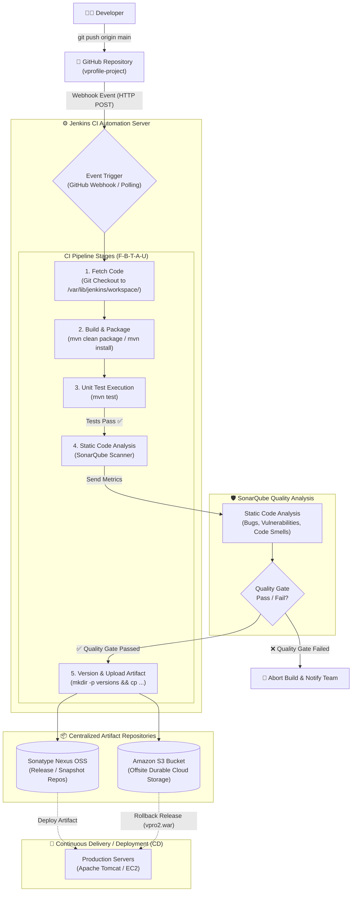
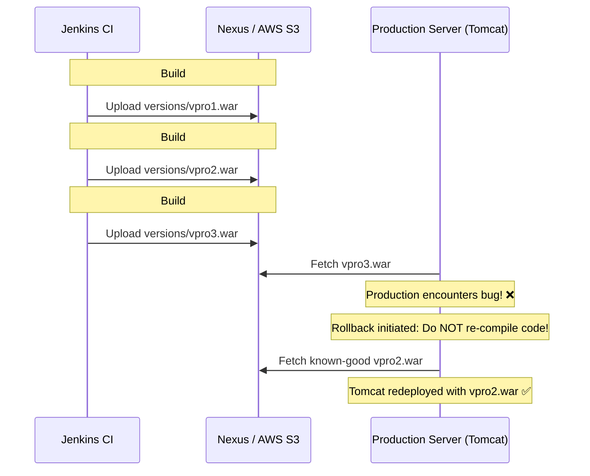

# 📊 Continuous Integration (CI) Pipeline Architecture & Flow Diagrams

This document illustrates the complete end-to-end architecture and stage-by-stage data flow of an automated Continuous Integration pipeline using **Git, GitHub, Jenkins, Maven, SonarQube, and Nexus OSS / AWS S3**.

---

## 🏗️ 1. Complete CI Pipeline Architecture (Mermaid Flowchart)



---

## 📐 2. The Comprehensive CI ASCII Flowchart

```text
                 DEVELOPER
                     │
                     │ git push origin main
                     ▼
                  GITHUB
                     │
                     │ Webhook Payload / SCM Polling
                     ▼
                  JENKINS (Automation Controller)
                     │
                     ▼
               ┌─────────────┐
               │ Fetch Code  │ ──> Tool: Git
               │             │ ──> Destination: /var/lib/jenkins/workspace/<job>/
               └──────┬──────┘
                      │
                      ▼
               ┌─────────────┐
               │    Build    │ ──> Tool: Apache Maven (MAVEN3.9)
               │             │ ──> Command: mvn clean package / mvn install
               └──────┬──────┘
                      │
                      ▼
               ┌─────────────┐
               │  Unit Test  │ ──> Tool: Maven Surefire Plugin (mvn test)
               │             │ ──> Verification: Pass / Fail
               └──────┬──────┘
                      │ (Pass)
                      ▼
               ┌─────────────┐
               │Code Analysis│ ──> Tool: SonarQube Scanner
               │             │ ──> Inspects: Bugs, Vulnerabilities, Code Smells
               └──────┬──────┘
                      │
                Quality Gate
                 PASS / FAIL
                      │
           ┌──────────┴──────────┐
           ▼                     ▼
       [ FAIL ]              [ PASS ]
           │                     │
           ▼                     ▼
      STOP BUILD          ┌─────────────┐
     Notify Devs          │Upload/Store │ ──> Tool: Nexus OSS / Amazon S3
                          │  Artifact   │ ──> Output: vprofile-v2.war (or vpro$BUILD_NUMBER.war)
                          └──────┬──────┘
                                 │
                                 ▼
                    Continuous Delivery / Deployment (CD)
```

---

## 🔬 3. Stage-by-Stage Detailed Breakdown

| Stage | Stage Name | Primary Tool | Command / Action | Key Purpose & Output |
|---|---|---|---|---|
| **F** | **Fetch Code** | Git | `git checkout` / `git clone` | Clones latest source code from GitHub into local job workspace (`/var/lib/jenkins/workspace/`). |
| **B** | **Build** | Apache Maven | `mvn clean package` or `mvn install` | Resolves dependencies via `pom.xml`, compiles Java bytecode, packages `target/vprofile-v2.war`. |
| **T** | **Test** | Maven Surefire | `mvn test` | Executes unit tests. Fails build immediately if logic assertions fail (**Fail-Fast Principle**). |
| **A** | **Analyze** | SonarQube | `mvn sonar:sonar` | Analyzes code quality, security vulnerabilities, code smells, duplication; validates against Quality Gate. |
| **U** | **Upload** | Nexus / S3 | Shell / S3 Plugin / Nexus Plugin | Versions the binary (`versions/vpro$BUILD_NUMBER.war`) and stores in centralized repository. |

---

## ⚖️ 4. Key Comparative Concept Tables

### Unit Test vs SonarQube Analysis
```text
┌───────────────────────────────────────┬──────────────────────────────────────────┐
│              Unit Test                │           SonarQube Analysis             │
├───────────────────────────────────────┼──────────────────────────────────────────┤
│ Tests functional correctness.         │ Tests static code quality & security.    │
│ "Does 100 + 200 return 300?"          │ "Are there SQL injections or code bugs?" │
│ Dynamic: Executes test methods.       │ Static: Scans source code and AST.       │
│ Output: Pass / Fail test cases.       │ Output: Quality Gate score, debt rating. │
└───────────────────────────────────────┴──────────────────────────────────────────┘
```

### GitHub vs Nexus Repository
```text
┌───────────────────────────────────────┬──────────────────────────────────────────┐
│        GitHub (Source Code)           │      Nexus / S3 (Artifact Store)         │
├───────────────────────────────────────┼──────────────────────────────────────────┤
│ Stores human-readable source files.   │ Stores packaged executable binaries.     │
│ .java, .xml, .properties, pom.xml     │ .war, .jar, .tar.gz, Docker images       │
│ Maintained for developers & reviewers.│ Maintained for servers & deploy tools.   │
│ Tracks incremental line-by-line diffs.│ Retains deployable release versions.     │
└───────────────────────────────────────┴──────────────────────────────────────────┘
```

---

## 🔁 5. The Rollback Mechanism Enabled by Artifact Versioning



---

## 🧠 6. Formula to Remember: **F ➔ B ➔ T ➔ A ➔ U**

* **F**etch (Git)
* **B**uild (Maven)
* **T**est (Unit Test)
* **A**nalyze (SonarQube)
* **U**pload (Nexus / S3)
