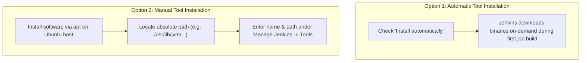

# 🛠️ Jenkins Installation & Tool Configuration Guide

This document provides step-by-step instructions for installing Jenkins on an Ubuntu Linux EC2 server, securing access, exploring internal directories, and configuring development tools (JDK, Maven, Git, and NodeJS) via **Manage Jenkins → Tools**.

---

## 📑 Table of Contents
1. [Jenkins Installation & Networking](#1-jenkins-installation--networking)
2. [SSH Access to the Jenkins Server](#2-ssh-access-to-the-jenkins-server)
3. [Jenkins Home Directory (`/var/lib/jenkins`)](#3-jenkins-home-directory-varlibjenkins)
4. [Retrieving the Initial Admin Password](#4-retrieving-the-initial-admin-password)
5. [The Jenkins Tools Administration Menu](#5-the-jenkins-tools-administration-menu)
6. [JDK Setup & `JAVA_HOME` Configuration](#6-jdk-setup--java_home-configuration)
7. [Maven Setup & Auto-Installation](#7-maven-setup--auto-installation)
8. [Git & Other Build Engines (NodeJS, Gradle, Ant)](#8-git--other-build-engines)
9. [Common Pitfalls & Troubleshooting](#9-common-pitfalls--troubleshooting)
10. [Interview Preparation & Revision Cheat Sheet](#10-interview-preparation--revision-cheat-sheet)

---

## 1. Jenkins Installation & Networking

Jenkins is commonly installed on an **Ubuntu Linux AWS EC2 instance**.

* **Default Port:** `8080`
* **Access URL:** `http://<SERVER-PUBLIC-IP>:8080`
  * Example: `http://44.202.22.36:8080`

### AWS Security Group Requirements
To access the Jenkins Web UI, ensure your EC2 instance's security group allows inbound traffic:
- **Type:** Custom TCP
- **Port:** `8080`
- **Source:** `0.0.0.0/0` (or restricted to your IP address)

---

## 2. SSH Access to the Jenkins Server

To configure tools and retrieve system credentials, connect via SSH using your EC2 private key:

```bash
# General syntax
ssh -i <key.pem> ubuntu@<SERVER-IP>

# Example from training session
ssh -i Downloads/Jenkins-serverkey.pem ubuntu@44.202.22.36

# Switch to root user
sudo -i
```

### Breakdown of the SSH Command
```text
ssh
├── -i                           # Specify identity/private key file
├── Downloads/Jenkins-serverkey.pem # Path to EC2 .pem key
├── ubuntu                       # Default username for Ubuntu AMIs
└── 44.202.22.36                 # Public IP address of the EC2 instance
```

---

## 3. Jenkins Home Directory (`/var/lib/jenkins/`)

Jenkins persists all its configuration, jobs, builds, and plugin files inside the **Jenkins Home Directory**:

```text
/var/lib/jenkins/
```

Verify directory contents using:
```bash
ls -la /var/lib/jenkins/
```

### Important Subdirectories & Files

| Path | Purpose |
|---|---|
| `/var/lib/jenkins/config.xml` | Global configuration settings for the Jenkins master. |
| `/var/lib/jenkins/jobs/` | Stores definitions, build histories, and console logs for every job. |
| `/var/lib/jenkins/plugins/` | Contains installed `.jpi` and `.hpi` plugin binaries. |
| `/var/lib/jenkins/secrets/` | Cryptographic keys and administrator bootstrap credentials. |
| `/var/lib/jenkins/users/` | Jenkins user database and credential mappings. |
| `/var/lib/jenkins/updates/` | Plugin metadata and cached update center catalogs. |
| `/var/lib/jenkins/workspace/` | Working folders where jobs checkout code and run builds. |

---

## 4. Retrieving the Initial Admin Password

During the first setup wizard, Jenkins generates a temporary cryptographic password to verify server ownership.

Retrieve it directly from the terminal:
```bash
cat /var/lib/jenkins/secrets/initialAdminPassword
```

*Example output:*
```text
ff05cfd8de5a45a6bb7c870a92302d7d
```

Copy and paste this string into the setup prompt in your web browser, then proceed to install recommended plugins and create your admin account.

---

## 5. The Jenkins Tools Administration Menu

Navigate in your browser to:
```text
Dashboard ──> Manage Jenkins ──> Tools
```

### Why Does Jenkins Need Tools?
Jenkins itself is an automation controller; it does not automatically know which compiler or runtime your project needs. For example:
```text
Source Code (GitHub) ──> Git ──> Maven ──> JDK 17 ──> Packaged WAR
```
If Jenkins does not know where these tools are located on disk, your builds will throw errors like `mvn: command not found` or `JAVA_HOME is not set`.

### Tool Installation Approaches



---

## 6. JDK Setup & `JAVA_HOME` Configuration

Java compatibility is vital. If a Maven project is written for Java 17, building it with Java 21 or Java 8 will trigger compilation failures.

### Step 1: Install OpenJDK 17 on the Ubuntu Server
```bash
# Update package indices
apt update

# Install OpenJDK 17 JDK
apt install openjdk-17-jdk -y

# Verify currently active default Java
java -version
```

### Step 2: Understand Installed JDK Versions
Installing JDK 17 does not necessarily switch the system default if Java 21 was previously installed. List all installed JDK paths:
```bash
ls -la /usr/lib/jvm/
```

*Sample output:*
```text
java-1.17.0-openjdk-amd64
java-17-openjdk-amd64         <=== The correct JDK 17 installation directory!
openjdk-17
java-1.21.0-openjdk-amd64
java-21-openjdk-amd64
```

### Step 3: Configure JDK in Jenkins UI
1. Go to **Manage Jenkins ➔ Tools ➔ JDK installations**.
2. Click **Add JDK**.
3. **Name:** `JDK17` (This identifier is referenced in job build steps and pipelines).
4. **Uncheck:** `Install automatically`.
5. **JAVA_HOME:** `/usr/lib/jvm/java-17-openjdk-amd64`.
6. Click **Save**.

### JDK vs `JAVA_HOME`
* **JDK:** The physical Java Development Kit binaries, compiler (`javac`), and standard libraries.
* **`JAVA_HOME`:** The system environment variable pointing to the root of that JDK folder.

---

## 7. Maven Setup & Auto-Installation

Maven is the primary build tool for Java enterprise applications.

### Option A: Automatic Installation (Recommended)
1. Go to **Manage Jenkins ➔ Tools ➔ Maven installations**.
2. Click **Add Maven**.
3. **Name:** `Maven3.9`
4. Check **Install automatically**.
5. Select **Install from Apache** ➔ Choose version `3.9.x`.
6. Click **Save**.

When a job configured with `Maven3.9` runs, Jenkins automatically downloads and configures Maven inside the job workspace.

### Option B: Manual Installation
```bash
apt install maven -y
mvn -version
```
Set `MAVEN_HOME` to `/usr/share/maven`.

---

## 8. Git & Other Build Engines

### Git Configuration
* Verify Git on the server:
  ```bash
  git --version
  ```
* Under **Git installations**, Jenkins defaults to `git` (which resolves to `/usr/bin/git`). Usually no changes are needed unless custom Git binaries are used.

### Additional Tools Supported in Tools Menu:
* **NodeJS:** Configured for frontend web applications (React, Angular, Vue, Node.js).
* **Gradle:** Modern Groovy/Kotlin-based build tool for Java/Kotlin/Android.
* **Ant:** Apache Ant for legacy Java enterprise packaging.

---

## 9. Common Pitfalls & Troubleshooting

### Error: `/usr/local/jvm doesn't look like a JDK directory`
* **Cause:** Typing an invalid or guessed path for `JAVA_HOME`.
* **Fix:** Run `ls /usr/lib/jvm/` in your server terminal. Use the exact folder name (e.g., `/usr/lib/jvm/java-17-openjdk-amd64`).

### Error: `mvn: command not found`
* **Cause:** Maven was not added to the build job's environment or was configured under a different tool name.
* **Fix:** In your Jenkins job configuration, under **Build Steps**, verify that `Maven Version` matches the exact name defined in Tools (e.g. `Maven3.9`).

---

## 10. Interview Preparation & Revision Cheat Sheet

### Essential Commands
```bash
# 1. SSH Login
ssh -i <key.pem> ubuntu@<IP>
sudo -i

# 2. Jenkins Password
cat /var/lib/jenkins/secrets/initialAdminPassword

# 3. Check Java & Directories
apt install openjdk-17-jdk -y
java -version
ls /usr/lib/jvm/
git --version
```

### Interview Q&A
* **Q: Why configure tools in Jenkins?**  
  *A:* To allow different jobs to build projects using specific, isolated compiler and runtime versions (e.g., Job A uses JDK 11, Job B uses JDK 17).
* **Q: Where does Jenkins store job and build data?**  
  *A:* `/var/lib/jenkins/` (`jobs/`, `workspace/`, `plugins/`).
* **Q: Where do you locate the initial admin password?**  
  *A:* `/var/lib/jenkins/secrets/initialAdminPassword`.
* **Q: What is the default HTTP port for Jenkins?**  
  *A:* Port `8080`.
