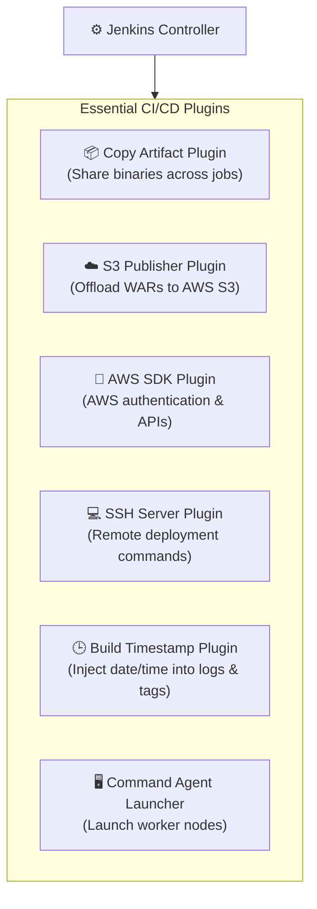
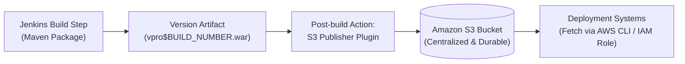

# 🧩 Jenkins Plugins, Environment Variables, Artifact Versioning & S3 Storage

This guide covers advanced build configuration in Jenkins: managing plugins, using built-in environment variables, versioning deployable artifacts, offsite storage in Amazon S3, and implementing automated rollback capabilities.

---

## 📑 Table of Contents
1. [Jenkins Plugins Architecture](#1-jenkins-plugins-architecture)
2. [Critical Plugins for CI/CD Pipelines](#2-critical-plugins-for-cicd-pipelines)
3. [Jenkins Built-in Environment Variables](#3-jenkins-built-in-environment-variables)
4. [Artifact Versioning Deep Dive](#4-artifact-versioning-deep-dive)
5. [Step-by-Step Versioning Commands](#5-step-by-step-versioning-commands)
6. [`$BUILD_NUMBER` vs Custom `$VERSION`](#6-build_number-vs-custom-version)
7. [External Artifact Storage via Amazon S3](#7-external-artifact-storage-via-amazon-s3)
8. [Production Rollback Mechanics](#8-production-rollback-mechanics)
9. [Build Steps vs Post-build Actions](#9-build-steps-vs-post-build-actions)
10. [One-Minute Rapid Revision & Cheat Sheet](#10-one-minute-rapid-revision--cheat-sheet)

---

## 1. Jenkins Plugins Architecture

A **Jenkins Plugin** is an extension module that integrates Jenkins with third-party tools, clouds, and build systems. While Jenkins core provides an orchestration engine, plugins provide the connectivity.

### Managing Plugins
Navigate to:
```text
Dashboard ──> Manage Jenkins ──> Plugins
```

| Section | Description & Actions |
|---|---|
| **Updates** | Lists already-installed plugins that have newer versions released. |
| **Available plugins** | Searchable catalog of community and vendor plugins ready to install. |
| **Installed plugins** | Overview of all active/inactive plugins; allows disabling or uninstalling. |
| **Advanced settings** | Configure HTTP proxies, upload custom `.hpi` files, and manage update center URLs. |
| **Download progress** | Real-time progress bar tracking downloaded and unpacked dependencies. |

---

## 2. Critical Plugins for CI/CD Pipelines



### Detailed Plugin Highlights
1. **Copy Artifact Plugin:**
   * Permits a downstream job (such as a Deploy or QA job) to copy artifacts generated by an upstream Build job.
   * Example: Build Job produces `vpro3.war` ➔ Deployment Job retrieves it and sends to Tomcat servers.
2. **S3 Publisher Plugin:**
   * Automatically copies artifacts out of the Jenkins workspace into an Amazon S3 bucket.
3. **Amazon Web Services SDK Plugin:**
   * Foundational library providing AWS APIs required by AWS-related plugins.
4. **SSH Server Plugin:**
   * Facilitates secure command execution on remote servers without manual keys configured inside scripts.
5. **Build Timestamp Plugin:**
   * Adds timestamp formatting variables (`BUILD_TIMESTAMP`) for logging and release tagging.

---

## 3. Jenkins Built-in Environment Variables

Jenkins automatically initializes environment variables for every build executor. These variables can be accessed in **Execute shell**, **Windows batch**, and **Pipeline** steps.

| Variable | What It Holds | Example Value |
|---|---|---|
| `$BUILD_NUMBER` | Monotonically incrementing build integer | `1`, `2`, `3`, `42` |
| `$BUILD_ID` | Identifier/timestamp of current build | `2026-09-19_12-30-00` |
| `$JOB_NAME` | Name of the executing Jenkins project | `vprofile-ci-pipeline` |
| `$WORKSPACE` | Absolute filesystem path of the job workspace | `/var/lib/jenkins/workspace/vprofile-ci` |
| `$NODE_NAME` | Worker machine handling the build | `built-in` or `slave-agent-01` |
| `$EXECUTOR_NUMBER`| Index of the executor slot running the step | `0` or `1` |
| `$JAVA_HOME` | Directory of the JDK assigned to this build | `/usr/lib/jvm/java-17-openjdk-amd64` |
| `$JENKINS_URL` | Base URL of the Jenkins controller | `http://44.202.22.36:8080/` |

### Easy Way to Remember:
```text
BUILD       ──> Which build?        ($BUILD_NUMBER)
JOB         ──> Which job?          ($JOB_NAME)
WORKSPACE   ──> Where on disk?      ($WORKSPACE)
NODE        ──> Which server/agent? ($NODE_NAME)
EXECUTOR    ──> Which worker slot?  ($EXECUTOR_NUMBER)
JAVA_HOME   ──> Which Java runtime? ($JAVA_HOME)
JENKINS_URL ──> Which master URL?   ($JENKINS_URL)
```

---

## 4. Artifact Versioning Deep Dive

### The Overwrite Problem
When Maven executes `mvn clean install`, it builds the target package specified in `pom.xml`:
```text
target/vprofile-v2.war
```
If every build outputs `vprofile-v2.war`:
- **Build #1** produces `vprofile-v2.war`.
- **Build #2** overwrites `vprofile-v2.war`.
- **Build #3** overwrites `vprofile-v2.war`.

If Build #3 introduces a critical production defect, the previous working artifact is gone!

### The Versioning Solution
We store every successful build output inside a dedicated directory (`versions/`) tagged with unique build metadata:

```text
versions/
├── vpro1.war  (Build #1)
├── vpro2.war  (Build #2 - Stable)
├── vpro3.war  (Build #3 - Failed)
└── vpro4.war  (Build #4 - Bugfix)
```

---

## 5. Step-by-Step Versioning Commands

Inside Jenkins **Build Steps ➔ Execute shell**:

```bash
# Step 1: Create versions directory if not present
mkdir -p versions

# Step 2: Copy artifact with dynamic build number
cp target/vprofile-v2.war versions/vpro$BUILD_NUMBER.war
```

### Detailed Command Breakdown
```text
cp
├── Source: target/vprofile-v2.war
└── Destination: versions/vpro$BUILD_NUMBER.war
```

* `mkdir -p versions`:
  * `-p` ensures no failure if the folder already exists, creating missing parent folders if necessary.
* When `$BUILD_NUMBER` is `3`, the command evaluates to:
  ```bash
  cp target/vprofile-v2.war versions/vpro3.war
  ```

---

## 6. `$BUILD_NUMBER` vs Custom `$VERSION`

```text
┌──────────────────────────────┬──────────────────────────────────────────┐
│        $BUILD_NUMBER         │             Custom $VERSION              │
├──────────────────────────────┼──────────────────────────────────────────┤
│ Automatically assigned.      │ Passed as a parameter or pipeline env.   │
│ Incremental integer: 1, 2, 3 │ Semantic versioning: 1.0.0, 2.3.6-RELEASE│
│ Simple & zero configuration. │ Granular control for release trains.     │
│ Command:                     │ Command:                                 │
│ cp app.war vpro$BUILD_NUMBER │ cp app.war vpro$VERSION.war              │
└──────────────────────────────┴──────────────────────────────────────────┘
```

---

## 7. External Artifact Storage via Amazon S3

Keeping artifacts strictly inside `/var/lib/jenkins/workspace/` is high risk:
- Workspaces are often wiped during clean checkout steps.
- Large `.war` or `.jar` files fill up Jenkins master disk space rapidly.
- If the Jenkins server crashes, all deployable binaries are lost.

### The S3 Storage Flow


### Advantages:
1. **11 9's Durability:** Amazon S3 protects artifacts against server loss.
2. **Decoupled Architecture:** Deployment scripts do not need SSH access to Jenkins.
3. **Clean Workspace:** Jenkins disk remains lean and operational.

---

## 8. Production Rollback Mechanics

Artifact versioning turns dangerous rollbacks into a trivial operation:

```text
Production Environment:
Current Active Release: vpro3.war (Defective! 💥)

DO NOT:
❌ Check out old Git commit
❌ Re-compile source code
❌ Re-run full test suite under production outage pressure

DO:
✅ Fetch previously verified vpro2.war from S3 / Nexus
✅ Deploy vpro2.war and restart application service
✅ Production restored in seconds!
```

> [!NOTE]
> Artifact repositories do not perform the deployment or rollback on their own. They **preserve the immutable deployable package**, making instant rollbacks possible!

---

## 9. Build Steps vs Post-build Actions

Inside Jenkins Job Configuration:

```text
1. General
2. Source Code Management (Git repository URL, branch)
3. Build Triggers (GitHub webhook, Poll SCM)
4. Build Environment (Inject passwords, timestamps)
5. Build Steps (Invoke Maven targets, Execute shell scripts)
6. Post-build Actions (Publish to S3, Archive Artifacts, Email Notifications)
```

* **Build Steps:** Actions executed to produce the output (compiling, testing, executing shell commands).
* **Post-build Actions:** Actions triggered based on the build outcome (publishing artifacts to S3, archiving files, sending Slack alerts).

---

## 10. One-Minute Rapid Revision & Cheat Sheet

### Core Concepts in 10 Seconds:
* **Plugin:** Extends Jenkins functionality (S3, Git, Copy Artifact).
* **Maven:** Builds and packages the application (`mvn install`).
* **Artifact:** The deployable binary output (`vprofile-v2.war`).
* **Versioning:** Preserving every build uniquely (`vpro$BUILD_NUMBER.war`).
* **S3 / Nexus:** Durable centralized storage for binaries.
* **Rollback:** Redeploying an earlier known-good artifact without recompiling code.

### The Standard CI Shell Execution Script:
```bash
# Build
mvn clean install

# Create Version Directory
mkdir -p versions

# Version Artifact
cp target/vprofile-v2.war versions/vpro$BUILD_NUMBER.war
```
