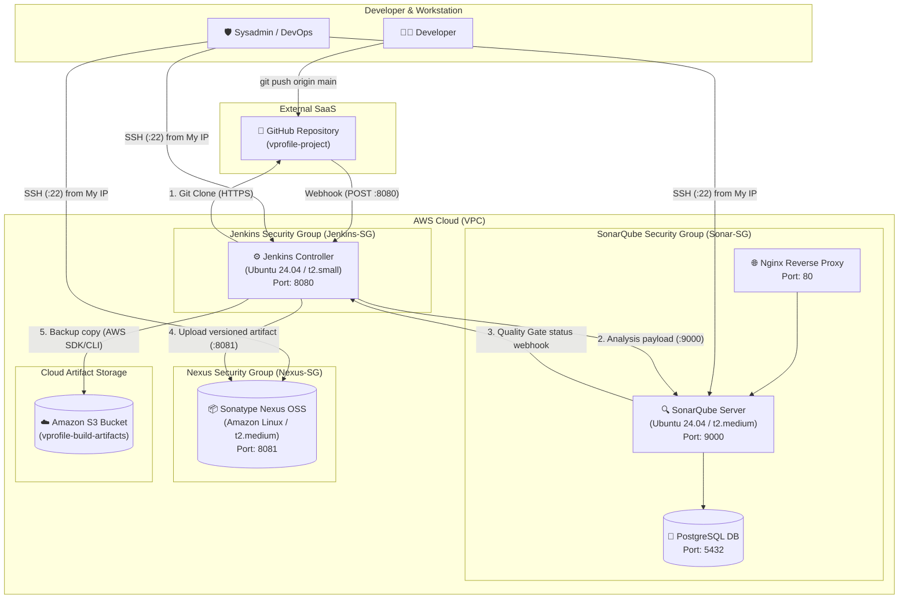
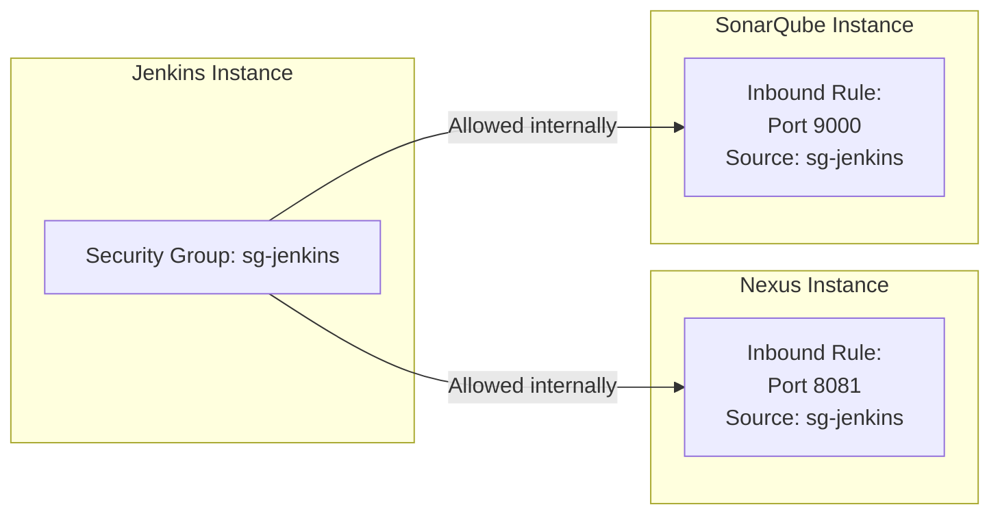
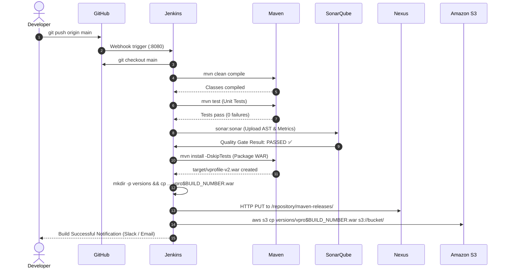

# 🏛️ End-to-End Enterprise CI/CD Architecture

This document provides a holistic blueprint of the complete DevOps infrastructure used across this repository, including server topologies, network security, inter-service communications, port mappings, and data flow.

---

## 🗺️ 1. Multi-Server Enterprise Architecture

In real-world production setups, CI/CD tools are segregated into dedicated virtual machines (AWS EC2 instances) to guarantee resource isolation, high availability, and strict security segmentation.

---

## 🔌 2. Port Mapping & Network Flow Table

| Source System | Destination System | Destination Port | Protocol | Purpose | Recommended Source CIDR / Security Rule |
|---|---|---|---|---|---|
| Admin PC | Jenkins EC2 | `22` | TCP | Secure Shell (SSH) access | `My IP/32` (Never `0.0.0.0/0`) |
| Admin PC | SonarQube EC2 | `22` | TCP | Secure Shell (SSH) access | `My IP/32` |
| Admin PC | Nexus EC2 | `22` | TCP | Secure Shell (SSH) access | `My IP/32` |
| User Browser | Jenkins EC2 | `8080` | TCP (HTTP) | Jenkins Management Web Interface | `My IP/32` or Company VPN CIDR |
| User Browser | SonarQube EC2 | `80` / `9000` | TCP (HTTP) | SonarQube Code Quality Dashboard | `My IP/32` or Company VPN CIDR |
| User Browser | Nexus EC2 | `8081` | TCP (HTTP) | Nexus Repository Web Interface | `My IP/32` or Company VPN CIDR |
| GitHub | Jenkins EC2 | `8080` | TCP (HTTP) | Webhook payload on code push | GitHub Webhook IP CIDR blocks |
| Jenkins EC2 | SonarQube EC2 | `9000` | TCP (HTTP) | Uploading scanner analysis reports | **`Jenkins-SG` (SG-to-SG reference)** |
| SonarQube EC2 | Jenkins EC2 | `8080` | TCP (HTTP) | SonarQube Quality Gate webhook | **`Sonar-SG` (SG-to-SG reference)** |
| Jenkins EC2 | Nexus EC2 | `8081` | TCP (HTTP) | Maven artifact binary upload | **`Jenkins-SG` (SG-to-SG reference)** |
| Jenkins EC2 | AWS S3 | `443` | TCP (HTTPS)| Upload binary archives to Cloud | IAM Role (Instance Profile) / S3 Gateway Endpoint |

---

## 🔒 3. Security Group to Security Group (SG-to-SG) Architecture

A fundamental enterprise security standard is **avoiding public IPs for internal communications**:

### Why SG-to-SG Rules Are Superior:
1. **Dynamic IP Resilience:** When EC2 instances stop and restart, public and private IPs may shift unless Elastic IPs are assigned. SG-to-SG rules evaluate membership rather than IP addresses.
2. **Zero Internet Exposure:** Port `8081` (Nexus) and Port `9000` (SonarQube) can be completely hidden from the public internet.

---

## 🖥️ 4. Server Sizing & Resource Allocation Rationale

| Server Role | OS Distribution | Recommended Instance Type | vCPU / RAM | Why This Sizing? |
|---|---|---|---|---|
| **Jenkins Controller** | Ubuntu 24.04 LTS | `t2.small` | 1 vCPU / 2 GB RAM | Handles web interface, job scheduling, and plugin execution. (For heavy parallel builds, offload to worker agents). |
| **SonarQube Server** | Ubuntu 24.04 LTS | `t2.medium` | 2 vCPU / 4 GB RAM | **Elasticsearch** is embedded within SonarQube, requiring at least 2 GB RAM solely for Java heap plus PostgreSQL overhead. |
| **Nexus OSS** | Amazon Linux 2023 | `t2.medium` | 2 vCPU / 4 GB RAM | Sonatype Nexus requires significant memory to run its OrientDB/database engine and cache maven/npm packages. |
| **Deployment Host (Tomcat)** | Ubuntu 22.04 LTS | `t2.micro` / `t2.small` | 1-2 vCPU / 1-2 GB RAM | Hosts Java servlet container (`tomcat9`) running `vprofile-v2.war`. |

---

## 🔄 5. End-to-End Data Flow Sequence

