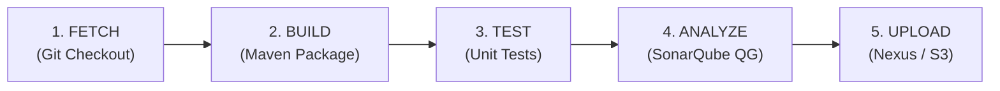
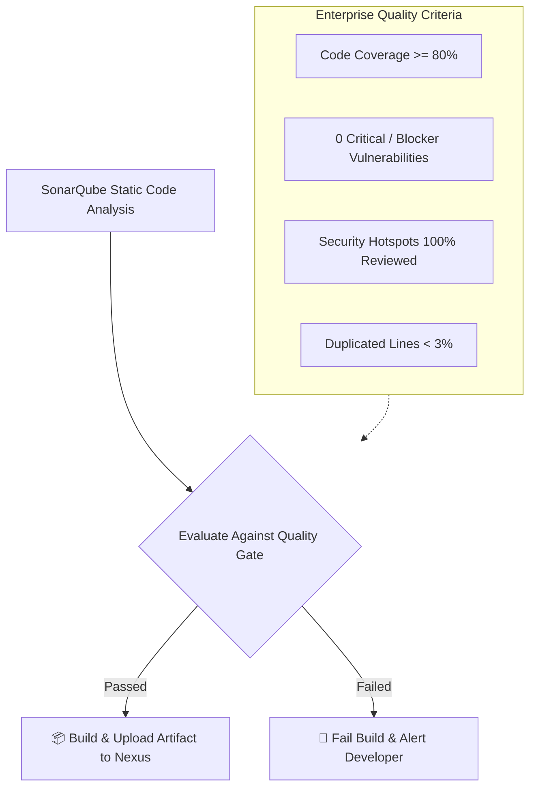
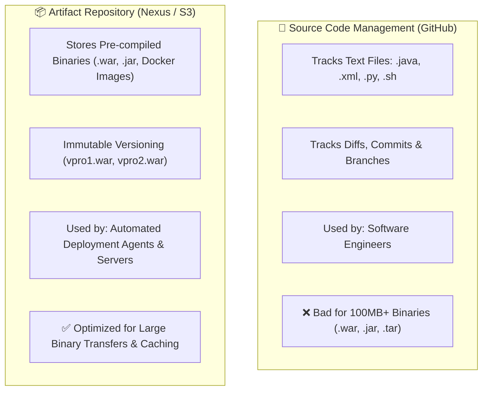

# 🔄 Continuous Integration & Continuous Delivery (CI/CD)

Continuous Integration (CI) and Continuous Delivery/Deployment (CD) represent the backbone of modern automated software delivery.

---

## 🧭 1. Deconstructing the Terminology

```text
+---------------------------------------------------------------------------------------------------+
|  1. Continuous Integration (CI)                                                                   |
|     Code Commit ──> Automated Build ──> Automated Tests ──> Code Analysis ──> Artifact Creation  |
+---------------------------------------------------------------------------------------------------+
                                                  │
                                                  ▼
+---------------------------------------------------------------------------------------------------+
|  2. Continuous Delivery (CD)                                                                      |
|     Artifact Published ──> Deploy to Staging ──> Integration / E2E Tests ──> [Manual Approval] ──> Production |
+---------------------------------------------------------------------------------------------------+
                                                  │
                                                  ▼
+---------------------------------------------------------------------------------------------------+
|  3. Continuous Deployment (CD)                                                                    |
|     Artifact Published ──> Deploy to Staging ──> Automated Verification ──> Direct Auto-Deploy to Production |
+---------------------------------------------------------------------------------------------------+
```

### Detailed Differences

| Feature | Continuous Integration (CI) | Continuous Delivery (CD) | Continuous Deployment (CD) |
|---|---|---|---|
| **Primary Goal** | Validate code health continuously and produce a tested artifact. | Ensure every passing build is technically ready to release. | Automatically push every passing change straight into production. |
| **Trigger** | Developer pushes code (`git push`). | Successful CI artifact creation. | Automated progression across test stages without human intervention. |
| **Release Step** | None (ends at artifact repository). | **Manual button click** by Product Owner or Release Manager. | **100% Automated** pipeline straight to production servers. |
| **Risk Profile** | Lowest (no production exposure). | Controlled (human gate before customer exposure). | Requires extensive automated end-to-end tests, canary testing, and auto-rollback. |

---

## ⚡ 2. The Golden CI Formula: F ➔ B ➔ T ➔ A ➔ U

To memorize the core continuous integration cycle, remember the **FBTAU** sequence:



### Deep-Dive into Each Stage

1. **F — Fetch Code:**
   * Jenkins receives a trigger (GitHub Webhook or SCM poll).
   * Checks out the designated Git commit/branch into the isolated job workspace (`/var/lib/jenkins/workspace/<job-name>`).
2. **B — Build:**
   * Apache Maven reads `pom.xml`, downloads external dependencies into `~/.m2/repository`, and compiles `.java` source code into `.class` bytecode files (`target/classes/`).
3. **T — Test (Fail-Fast Verification):**
   * Executes unit tests via `mvn test` (using Surefire plugin).
   * **Fail-Fast Principle:** If any assertion fails, the pipeline terminates immediately. Broken code is never packaged.
4. **A — Analyze (Static Code Inspection):**
   * SonarQube Scanner inspects code syntax, cyclomatic complexity, security vulnerabilities, and code duplication.
   * Evaluates the metrics against the **Quality Gate**. If the Quality Gate fails, Jenkins halts the pipeline before binary creation.
5. **U — Upload Artifact:**
   * Packages the application into a deployable archive (`vprofile-v2.war` or `.jar`).
   * Versions the artifact with a build identifier (`mkdir -p versions && cp target/vprofile-v2.war versions/vpro$BUILD_NUMBER.war`).
   * Pushes the versioned binary to a centralized repository (Sonatype Nexus OSS or AWS S3).

---

## 🛡️ 3. The Quality Gate: The CI Checkpoint

A Quality Gate establishes a measurable threshold that determines whether software meets the enterprise standard for release.



> [!IMPORTANT]
> **Why Jenkins Must Block Broken Quality Gates:**
> Storing an untested or low-quality artifact in an enterprise repository wastes storage, pollutes versioning, and risks deploying vulnerable binaries to customer-facing environments.

---

## 📦 4. Source Code Repository vs Artifact Repository

A common confusion in junior DevOps engineers is storing binaries in Git:



---

## 📈 5. Continuous Delivery Deployment Strategies

When CD takes over after artifact upload, modern infrastructure leverages zero-downtime deployment patterns:

* **Rolling Deployment:** Gradually replaces instances of the previous version with the new version (e.g. 25% at a time).
* **Blue/Green Deployment:** Two identical environments exist (`Blue` = live, `Green` = staging). Once tests pass on Green, router/load balancer traffic switches instantaneously.
* **Canary Deployment:** Routes 5% of real user traffic to the new version. If error rates remain normal, traffic ramps to 25%, 50%, then 100%.
