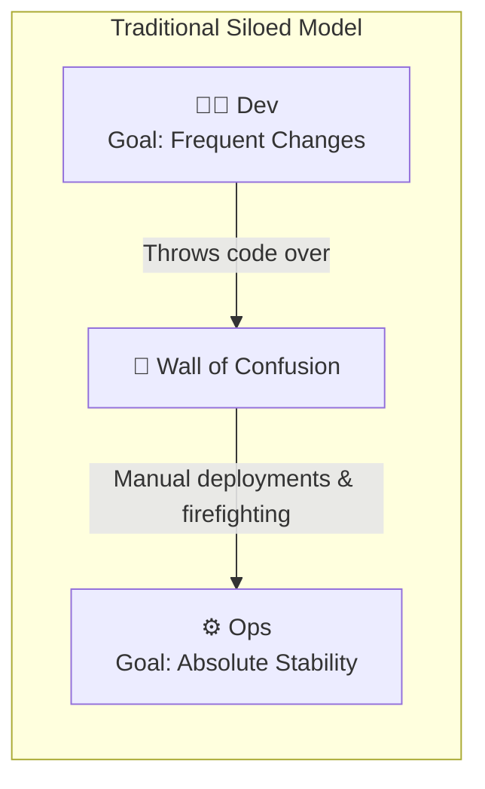
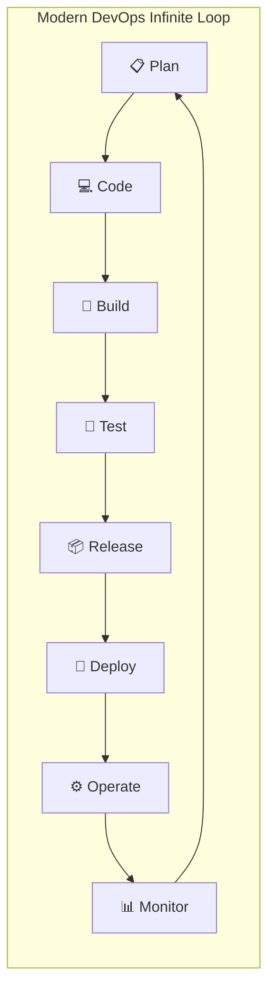

# 🌐 DevOps Overview & Culture

DevOps is a set of practices, cultural philosophies, and tools that combines Software Development (**Dev**) and Information Technology Operations (**Ops**). Its primary mission is to shorten the systems development life cycle and provide continuous delivery with high software quality.

---

## 🎯 1. The Core Philosophy of DevOps

Before DevOps, software delivery suffered from the **"Wall of Confusion"**:
* **Developers** were incentivized to deliver features quickly (*change*).
* **Operations** were incentivized to keep infrastructure stable (*uptime and zero change*).
* Developers threw code over the wall; when it broke in production, Operations blamed buggy code, and Developers blamed misconfigured servers (*"It worked on my machine!"*).



### The DevOps Solution
DevOps merges these mindsets through:
1. **Shared Responsibility:** Developers care about runtime stability; Operations engineers provide self-service automated platforms.
2. **Infrastructure as Code (IaC):** Treating server definitions, networks, and environments with the same rigor as application source code.
3. **Continuous Feedback:** Monitoring production metrics and user errors directly back into developer backlog sprints.
4. **Automation at Every Stage:** Replacing error-prone manual handoffs with automated pipelines (Lint ➔ Compile ➔ Test ➔ Quality Check ➔ Package ➔ Deploy).



---

## 🏛️ 2. Core Pillars of DevOps (CAMS Model)

| Pillar | Principle | Real-World Application in this Repository |
|---|---|---|
| **C — Culture** | Empathy, psychological safety, blame-free postmortems, and shared ownership. | Developers write automated unit tests; DevOps sets up reproducible Jenkins pipelines. |
| **A — Automation** | If a task is repeated more than twice, automate it. | Bash provisioning scripts (`userdata/`), Maven lifecycle automation, Jenkinsfiles. |
| **M — Measurement** | Data-driven engineering. Measuring build durations, failure rates, MTTR, and code coverage. | SonarQube static code quality metrics, Quality Gate enforcement, test pass percentages. |
| **S — Sharing** | Open documentation, cross-functional pairing, and shared visibility into pipelines. | Centralized artifacts in Nexus, shared Git repositories, unified documentation knowledge bases. |

---

## 📊 3. The 4 Key DORA Metrics

The **DevOps Research and Assessment (DORA)** team established four critical metrics that differentiate elite engineering teams from low-performing organizations:

1. **Deployment Frequency (DF):** How often an organization successfully releases to production (elite teams: multiple times per day; low performers: once per quarter/year).
2. **Lead Time for Changes (LTFC):** The time it takes for a commit to go from code review to running in production.
3. **Change Failure Rate (CFR):** The percentage of deployments causing a failure in production requiring a hotfix or rollback.
4. **Mean Time to Recovery (MTTR):** How quickly an organization restores service when an incident occurs.

---

## 🛠️ 4. The DevOps Toolchain Landscape

Every tool in the DevOps toolchain addresses a distinct responsibility in the delivery lifecycle:

```text
+----------------------------------------------------------------------------------------------------+
|                                    THE DEVOPS TOOLCHAIN ECOSYSTEM                                  |
+-------------------+--------------------+--------------------+-------------------+------------------+
| 1. Code & SCM     | 2. CI & Build      | 3. Quality & Sec   | 4. Repositories   | 5. Runtime & CD  |
+-------------------+--------------------+--------------------+-------------------+------------------+
| • Git             | • Jenkins          | • SonarQube        | • Sonatype Nexus  | • Docker         |
| • GitHub          | • Apache Maven     | • OWASP Dependency | • JFrog Artifactory| • Kubernetes     |
| • GitLab          | • Gradle / npm     | • Checkstyle       | • AWS S3          | • AWS EC2 / ECS  |
+-------------------+--------------------+--------------------+-------------------+------------------+
| 6. Infra as Code  | 7. Config Mgmt     | 8. Monitoring      | 9. Cloud Provider | 10. Scripting    |
+-------------------+--------------------+--------------------+-------------------+------------------+
| • Terraform       | • Ansible          | • Prometheus       | • AWS             | • Bash / Shell   |
| • CloudFormation  | • Puppet / Chef    | • Grafana / ELK    | • Azure / GCP     | • Python         |
+-------------------+--------------------+--------------------+-------------------+------------------+
```

---

## ⚠️ 5. Common Anti-Patterns & Pitfalls

1. **"DevOps Team" Silo:** Creating a separate "DevOps team" that acts as another barrier between Dev and Ops rather than fostering cultural integration.
2. **Tool-Obsession Without Cultural Change:** Buying expensive enterprise licenses (e.g. Jenkins Enterprise, SonarQube Enterprise) while still requiring 10-person manual CAB (Change Advisory Board) approval meetings.
3. **Automating Broken Processes:** Automating a manual deployment script that takes 6 hours and has no rollback capabilities simply produces faster failures.
4. **Ignoring Non-Functional Requirements:** Failing to validate security vulnerabilities (DevSecOps), infrastructure performance, and operational logging during early pipeline stages.

---

## 🎯 6. Real-World Enterprise Example

In an enterprise banking application:
* A developer commits a change to an account balance transfer service.
* Git triggers a Jenkins webhook within seconds.
* Jenkins isolates the build on an ephemeral worker, compiles with Maven, runs 450 unit tests, and invokes SonarQube.
* SonarQube blocks the build because a developer introduced a potential SQL injection vulnerability (**Quality Gate Failure**).
* The developer receives an automated Slack notification within 3 minutes of pushing code. Production remains 100% safe.
