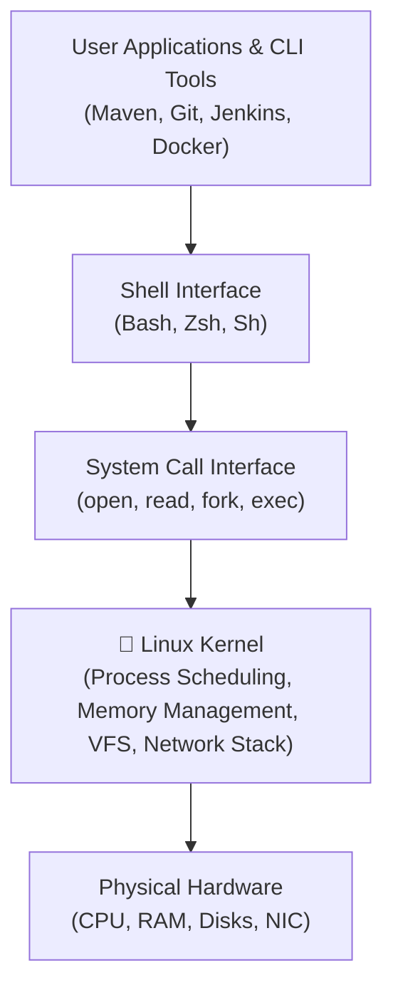

# 🐧 Linux Fundamentals for DevOps

Linux is the dominant operating system powering cloud servers, containers, virtualization, and CI/CD runners. A DevOps engineer must master Linux internals, the filesystem hierarchy, and process lifecycle.

---

## 📂 1. The Linux Filesystem Hierarchy (FHS)

Everything in Linux is represented as a file or a stream of bytes starting at the root `/`.

```text
/ (Root Directory)
├── bin/          -> Essential user command binaries (ls, cp, rm, bash)
├── boot/         -> Static files of the boot loader (grub, vmlinuz kernel)
├── dev/          -> Device files representing hardware (sda, xvda, urandom)
├── etc/          -> Host-specific system-wide configuration files (nginx, sysctl.conf)
├── home/         -> User personal directories (/home/ubuntu)
├── lib/          -> Shared libraries essential for binaries in /bin and /sbin
├── media/        -> Removable media mount points (USB drives)
├── mnt/          -> Temporarily mounted filesystems
├── opt/          -> Add-on application software packages (/opt/nexus, /opt/sonarqube)
├── proc/         -> Virtual filesystem documenting kernel state and running processes
├── root/         -> Home directory for the root superuser
├── sbin/         -> Essential system admin binaries (fdisk, reboot, iptables)
├── tmp/          -> Temporary files (cleared across reboots)
├── usr/          -> Multi-user utilities and applications (/usr/lib/jvm for Java)
└── var/          -> Variable data files that grow over time
    ├── lib/      -> State information (/var/lib/jenkins, /var/lib/docker)
    ├── log/      -> System and daemon logs (/var/log/syslog, /var/log/nginx)
    └── run/      -> Runtime process identifiers (PID files)
```

### Critical Directories for DevOps:
* **`/var/lib/jenkins/`**: The state home of Jenkins where all jobs, workspaces, and plugins live.
* **`/opt/nexus/` & `/opt/sonarqube/`**: Standard enterprise installation homes for third-party tools.
* **`/etc/systemd/system/`**: Location where custom service units (`nexus.service`, `sonarqube.service`) are created.
* **`/usr/lib/jvm/`**: Where OpenJDK runtimes reside (`java-17-openjdk-amd64`).

---

## ⚙️ 2. Linux Architecture & The Kernel



---

## 🐚 3. Standard Streams & Redirection

Every process launched in Linux automatically opens three standard file descriptors:

| File Descriptor | Name | Default Stream | Redirection Operator |
|---|---|---|---|
| `0` | `stdin` | Keyboard input | `<` |
| `1` | `stdout` | Screen output | `>`, `>>` (append) |
| `2` | `stderr` | Screen error messages | `2>`, `2>>` |

### Redirection Examples in CI/CD Automation:
```bash
# Redirect output to file, discarding errors
mvn clean package > build.log 2>/dev/null

# Combine stdout and stderr into a single log file
sh setup.sh > full_output.log 2>&1

# Append log entry with timestamp
echo "[$(date)] Deployment finished" >> /var/log/deploy.log
```

---

## 👥 4. Users, Groups, and the Root Account

* **Root (`UID 0`):** The unrestricted superuser with full control over the operating system.
* **System Service Accounts (`UID < 1000`):** Non-login service users (`jenkins`, `nexus`, `sonar`, `postgres`) specifically created to run services with restricted permissions.
* **Regular Users (`UID >= 1000`):** Interactive accounts (`ubuntu`, `ec2-user`).

> [!IMPORTANT]
> **The Principle of Least Privilege:**
> Never execute application runtimes as `root`. If a web vulnerability is exploited inside a process running as root, the attacker gains immediate control of the host. In our setups, Jenkins runs as user `jenkins`, Nexus as `nexus`, and SonarQube as `sonar`.
