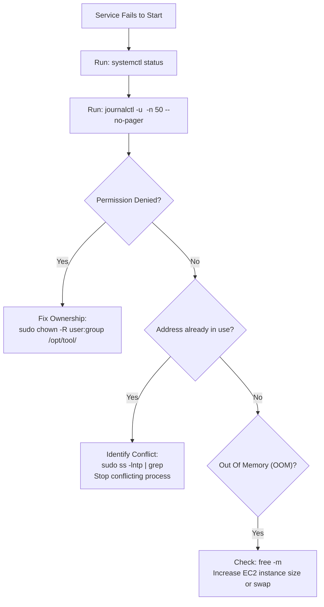

# 🩺 Linux Troubleshooting & Diagnostics

A step-by-step diagnostic guide for Linux system failures encountered during DevOps workflows.

---

## 🚨 Incident 1: "No space left on device" (Disk Exhaustion)

### Symptoms:
* A Jenkins build aborts suddenly during `mvn clean install`:
  ```text
  [ERROR] Failed to execute goal ... No space left on device
  [INFO] ------------------------------------------------------------------------
  [INFO] BUILD FAILURE
  ```
* Later pipeline stages report `SKIPPED`.

### Step-by-Step Diagnostic & Recovery:

#### Step 1: Check Mount Point Capacity
```bash
df -h
```
*Look for filesystems with 90%+ utilization (especially `/dev/root` mounted on `/`).*

#### Step 2: Identify Consuming Folders
```bash
# Check the largest directories in Jenkins home
sudo du -sh /var/lib/jenkins/* | sort -hr | head -n 10

# Check Maven cache size
sudo du -sh /var/lib/jenkins/.m2/repository/
```

#### Step 3: Immediate Triage (Freeing Space)
```bash
# Clean apt package cache
sudo apt-get clean
sudo apt-get autoremove -y

# Clean older log archives
sudo journalctl --vacuum-size=200M

# Delete old test workspaces
rm -rf /var/lib/jenkins/workspace/OldUnusedJob/
```

#### Step 4: Permanent Remediation
Expand the AWS EBS volume size (e.g. from 8 GB to 20 GB) and resize the partition. (See [AWS EBS Guide](../03-aws/ebs.md)).

---

## 🚨 Incident 2: Service Fails to Start (`systemctl start ...` exits with error)

### Symptoms:
```text
Job for sonarqube.service failed because the control process exited with error code.
See "systemctl status sonarqube.service" and "journalctl -xeu sonarqube.service" for details.
```

### Diagnostic Flowchart:



---

## 🚨 Incident 3: Port Listening Locally But Web UI Unreachable

### Symptoms:
* `curl -I http://localhost:8080` returns `HTTP/1.1 200 OK` on the EC2 shell.
* Opening `http://<PUBLIC_IP>:8080` in your desktop browser times out.

### Root Cause Checklist:
1. **AWS Security Group:** Check if Inbound rule allows TCP 8080 from your current public IP.
2. **Local Linux Firewall (`ufw` / `iptables`):**
   ```bash
   sudo ufw status
   # If active, allow traffic:
   sudo ufw allow 8080/tcp
   ```
3. **Public vs Private IP:** Ensure you are connecting to the instance's **Public IPv4 address**, not the private VPC subnet IP (`172.31.x.x`).
