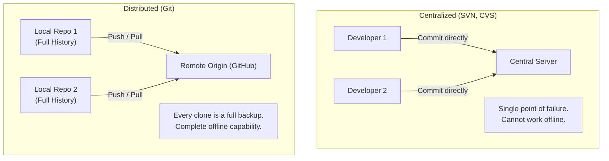
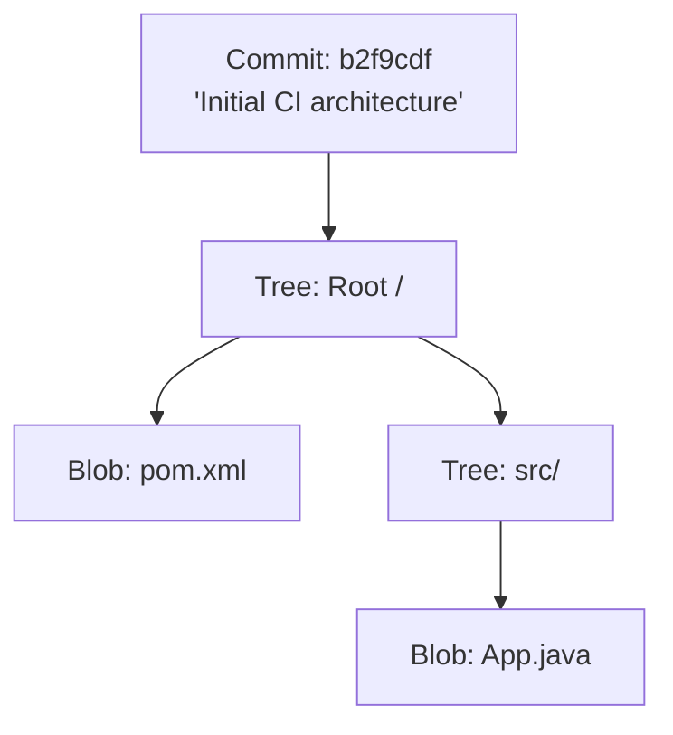

# 🐙 Git Fundamentals & Core Concepts

Git is a distributed version control system (DVCS) designed to handle everything from small to very large projects with speed and efficiency.

---

## 🏛️ 1. Centralized vs Distributed Version Control



---

## 🏗️ 2. The 3 Areas of Git (Plus Remote)

Understanding Git requires understanding where your code resides at each stage:

```text
+---------------------+         +--------------------+         +--------------------+         +--------------------+
|  Working Directory  |         |   Staging Area     |         |  Local Repository  |         | Remote Repository  |
|  (Untracked / Edit) |         |      (Index)       |         |      (.git/)       |         |      (GitHub)      |
+---------------------+         +--------------------+         +--------------------+         +--------------------+
           │                               │                              │                              │
           │────────── git add ───────────>│                              │                              │
           │                               │───────── git commit ────────>│                              │
           │                               │                              │───────── git push ──────────>│
           │<────────────────────────────── git pull ────────────────────────────────────────────────────│
           │<──────────────────────── git checkout / restore ─────────────│                              │
```

1. **Working Directory:** Actual files on your local disk that you edit in VS Code or an IDE.
2. **Staging Area (Index):** A draft snapshot of changes being prepared for the next commit.
3. **Local Repository (`.git/`):** The permanent local database storing all committed snapshots and branch references.
4. **Remote Repository (GitHub):** The centralized cloud host enabling team collaboration and CI pipeline webhooks.

---

## 🔍 3. Git Internal Objects: Blobs, Trees, and Commits

Git is fundamentally a content-addressable filesystem:
* **Blob:** Stores raw file data (identified by SHA-1/SHA-256 hash).
* **Tree:** Represents a directory structure, mapping filenames to blob hashes.
* **Commit:** A pointer to a top-level root tree, containing metadata (author, timestamp, commit message, parent commit pointer).


