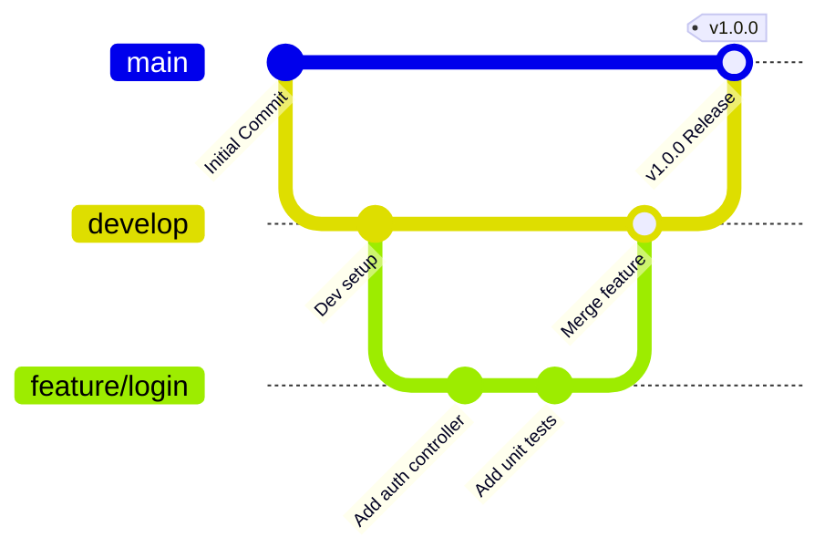

# 🌿 Git Branching Strategies & Workflows

Branching allows engineers to diverge from the main line of development to work on new features, bugfixes, or experiments in complete isolation.

---

## 🔀 1. Branch Commands & Mechanics

A Git branch is simply a lightweight, movable 41-byte pointer to a commit hash.

```bash
# List local branches (* indicates currently checked out branch)
git branch

# List all branches including remote tracking branches
git branch -a

# Create and switch to a new branch in a single command
git checkout -b Continuous-Integration-and-Delivery-with-Jenkins
# Or using modern git switch:
git switch -c feature/sonar-integration

# Switch between existing branches
git checkout main
git switch main

# Rename current branch
git branch -m new-branch-name

# Delete a merged local branch
git branch -d feature-branch

# Force delete an unmerged local branch
git branch -D feature-branch

# Delete a remote branch on GitHub
git push origin --delete feature-branch
```

> [!IMPORTANT]
> **Git Ref Naming Rules:**
> Git branches **cannot contain spaces** (`fatal: '...' is not a valid branch name`). Always use hyphens (`-`), underscores (`_`), or forward slashes (`/`), e.g., `feature/ci-pipeline` or `Continuous-Integration-and-Delivery-with-Jenkins`.

---

## 🏗️ 2. Popular Branching Models

### A. GitFlow
* `main`: Production-ready releases.
* `develop`: Integration branch for features.
* `feature/*`: Branched from `develop`, merged back via PR.
* `release/*`: Pre-release stabilization.
* `hotfix/*`: Emergency fixes directly branched from `main`.



### B. Trunk-Based Development (Preferred in Modern DevOps)
Developers collaborate on a single main branch ("trunk"), committing small, frequent updates. Short-lived feature branches exist for less than a day and merge continuously through automated CI quality gates.

---

## ⚔️ 3. Merge vs Rebase

```text
Merge:
A ─── B ─── C ─── M (Merge Commit)
       \         /
        D ─── E /

Rebase:
A ─── B ─── C ─── D' ─── E' (Linear History)
```

| Strategy | Command | Pros | Cons |
|---|---|---|---|
| **Merge** | `git merge feature` | Preserves complete chronological history and branch context. | Can result in cluttered commit graph with many merge commits. |
| **Rebase** | `git rebase main` | Produces a clean, linear commit history. | Rewrites commit SHAs; **never rebase shared public branches**. |
