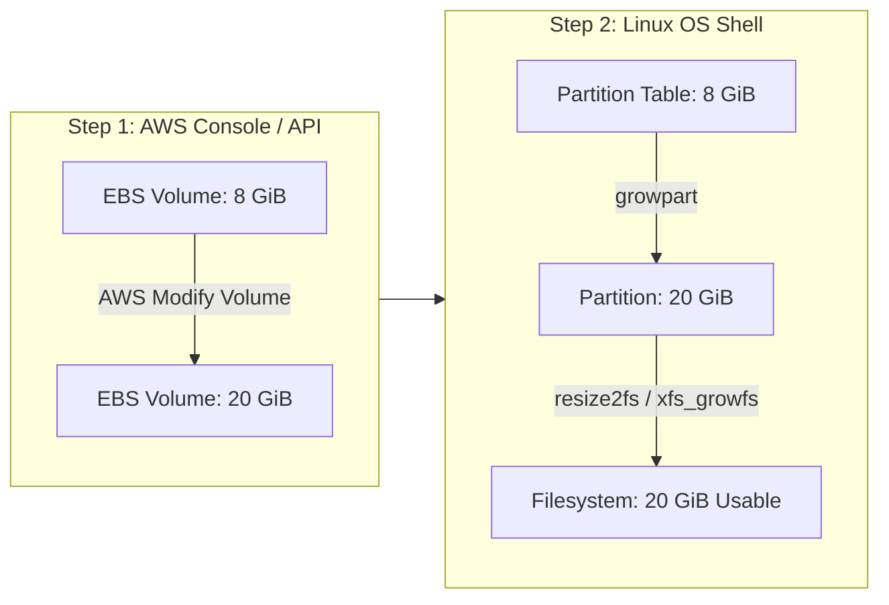

# 💾 AWS EBS Volume Management & Filesystem Resizing

Amazon Elastic Block Store (EBS) provides block-level storage volumes for use with EC2 instances. In this guide, we examine why storage exhaustion occurs and the exact end-to-end process for expanding an active EBS root volume without downtime.

---

## 💥 1. The Root Cause of "No space left on device"

By default, standard Ubuntu AMI instances launch with an **8 GiB** root EBS volume.

Inside Jenkins, multiple build activities quickly overwhelm this storage:
1. **Maven Local Repository (`/var/lib/jenkins/.m2/repository`):** Downloads hundreds of external JAR dependencies for Spring, Hibernate, Tomcat, and MySQL drivers.
2. **Build Workspaces (`/var/lib/jenkins/workspace/`):** Contains compiled `.class` files, unit test reports, and large packaged `.war` binaries.
3. **Build History & Logs (`/var/lib/jenkins/jobs/`):** Each build retains console logs and archived artifacts.

```text
Filesystem      Size  Used Avail Use% Mounted on
/dev/root       6.8G  6.3G  459M  94% /             <=== CRITICAL WARNING SIGN
```

When free space hits 0%, Maven crashes with:
```text
[ERROR] Failed to execute goal org.apache.maven.plugins:maven-install-plugin:3.1.1:install: 
No space left on device
```

---

## 🔄 2. The Two-Step Expansion Concept

> [!IMPORTANT]
> **Crucial Concept:**
> Modifying the volume size in the AWS Console **does not automatically resize the Linux filesystem inside the OS!**
> 
> * **Step 1 (AWS Level):** Expands the underlying virtual disk (hardware boundary).
> * **Step 2 (Linux OS Level):** Extends the partition table and grows the filesystem (software boundary) to recognize the new blocks.



---

## 🛠️ 3. Step-by-Step Practical Expansion Walkthrough

### Step 1: Modify Volume in AWS Console
1. Navigate to **AWS Console ➔ EC2 ➔ Elastic Block Store ➔ Volumes**.
2. Identify the volume attached to your Jenkins instance (check the Instance ID column).
3. Select **Actions ➔ Modify Volume**.
4. Change **Size (GiB)** from `8` to `20`.
5. Click **Modify** and confirm. (Status changes to `in-use (optimizing)`).

---

### Step 2: SSH into Linux Server & Inspect Disks
Connect to the server and inspect the block devices:

```bash
lsblk
```

*Example Output:*
```text
NAME         MAJ:MIN RM  SIZE RO TYPE MOUNTPOINTS
xvda         202:0    0   20G  0 disk                 <=== Virtual Disk is now 20 GB!
├─xvda1      202:1    0    8G  0 part /               <=== Partition is still stuck at 8 GB!
├─xvda14     202:14   0    4M  0 part 
└─xvda15     202:15   0  106M  0 part /boot/efi
```

Notice that `xvda` is 20 GB, but partition 1 (`xvda1`) is still 8 GB.

---

### Step 3: Extend the Partition using `growpart`

Install `cloud-guest-utils` (if not already present) and run `growpart`:

```bash
# Syntax: growpart <device-name> <partition-number>
sudo growpart /dev/xvda 1

# If on NVMe-based Nitro instances (t3, c5):
# sudo growpart /dev/nvme0n1 1
```

*Expected Output:*
```text
CHANGED: partition=1 start=227328 old: size=16550879 end=16778207 new: size=41715679 end=41943007
```

Verify with `lsblk`:
```bash
lsblk
```
`xvda1` will now show `20G`.

---

### Step 4: Expand the Filesystem

Now inform the filesystem to utilize the newly added partition sectors. First, check your filesystem format:

```bash
df -Th /
```

#### For ext4 Filesystem (Standard Ubuntu):
```bash
sudo resize2fs /dev/xvda1
# Or for NVMe:
# sudo resize2fs /dev/nvme0n1p1
```

#### For XFS Filesystem (Standard Amazon Linux / RHEL):
```bash
sudo xfs_growfs -d /
```

---

### Step 5: Verify Final Usable Capacity

```bash
df -h /
```

*Expected Output:*
```text
Filesystem      Size  Used Avail Use% Mounted on
/dev/root        19G  6.3G   13G  33% /               <=== 13 GB Free Space! Build issues resolved!
```

---

## ⚠️ 4. Production Precautions
* **Snapshot Before Modification:** Always create an EBS snapshot prior to modifying storage in production.
* **Volume Shrink Impossibility:** AWS EBS allows volume sizes to be increased, but **they can never be decreased**.
* **Billing Impact:** You are billed for 20 GB of provisioned storage every month going forward.
