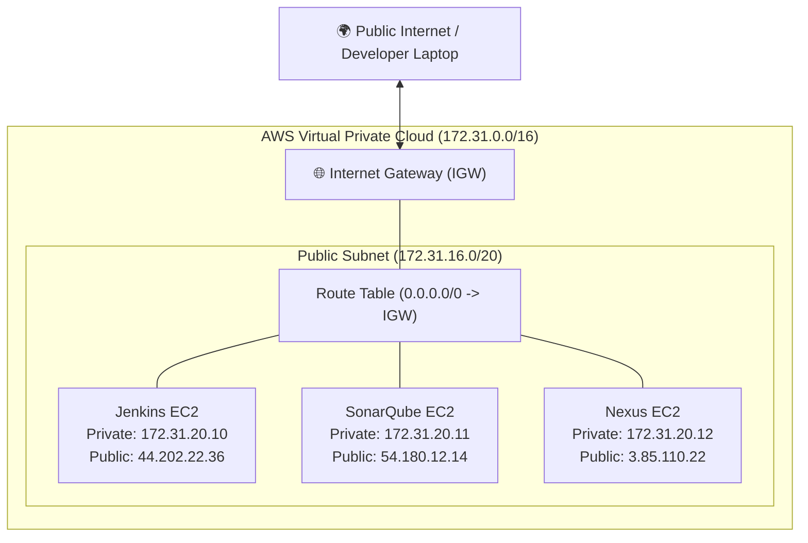

# 🌐 AWS Networking Fundamentals for DevOps

A clear understanding of VPC, Subnets, Routing, and Internet Gateways is required to connect distributed DevOps components.

---

## 🏛️ 1. VPC Architecture Diagram

---

## 🔍 2. Public IP vs Private IP vs Elastic IP

| IP Type | Persistence Across Reboot | Persistence Across Stop/Start | Incurs Cost? | Use Case |
|---|---|---|---|---|
| **Public IPv4** | Retained | **Lost / Changes to new IP** | Included with running EC2 | Direct internet access for lab testing. |
| **Private IPv4** | Retained | **Retained** | Free | Internal communication (Jenkins to Nexus/Sonar). |
| **Elastic IP (EIP)**| Retained | **Retained permanently** | Free if attached to running EC2; billed if unattached | Production web entry points and fixed webhook URLs. |

> [!TIP]
> **Internal Service Communication Tip:**
> When configuring the Nexus or SonarQube URL inside Jenkins, use their **Private IP** (`http://172.31.20.12:8081`), not their public IP! Private IP traffic stays on AWS internal fiber, provides lower latency, and incurs zero data transfer costs.
