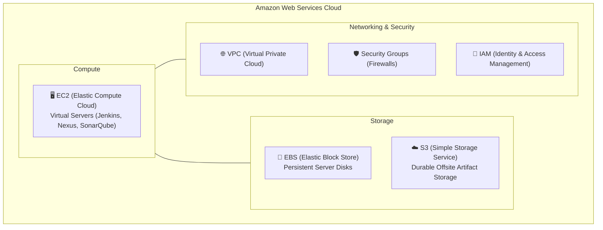

# ☁️ Amazon Web Services (AWS) Overview for DevOps

Amazon Web Services (AWS) is the world's most comprehensive cloud computing platform, offering over 200 fully featured services from data centers globally.

---

## 🏛️ 1. Core AWS Services Used in this Knowledge Base

### Roles of Each Service:
* **Amazon EC2:** Provides resizable compute capacity (Ubuntu 24.04 and Amazon Linux 2023 instances) hosting our CI/CD toolchain.
* **Amazon EBS:** Provides high-performance raw block-level storage volumes attached directly to EC2 instances.
* **Amazon S3:** Highly available, redundant object storage (99.999999999% durability) used for archiving versioned application builds (`.war`).
* **Security Groups:** Stateful virtual firewalls that control inbound and outbound traffic at the instance level.
* **AWS IAM:** Controls authentication and authorization for AWS resources without embedding static credentials into build code.

---

## 💰 2. Cost Management & Billing Precautions

Running multiple EC2 instances (`t2.small`, `t2.medium`), unattached EBS volumes, and Elastic IPs can rapidly generate surprise cloud bills:

1. **Stop or Terminate Lab Instances:**
   * When not actively running build pipelines, **Stop** your EC2 instances. Stopped instances do not incur compute charges (though EBS storage continues to bill).
   * If you are completely finished with a module, **Terminate** the instance and verify associated EBS volumes are deleted.
2. **Watch Unattached EBS Volumes:**
   * If an EC2 instance is terminated without *Delete on Termination* checked, the EBS disk continues billing monthly per GB.
   * Regularly inspect `EC2 Dashboard -> Volumes -> Filter: Available` (unattached) and delete them.
3. **Configure AWS Billing Alarms:**
   * Go to **CloudWatch ➔ Alarms ➔ Create Alarm ➔ EstimatedCharges**.
   * Configure an alert threshold (e.g. $5.00 or $10.00) that sends immediate notifications via Amazon SNS to your email.
4. **Beware of Free Tier Limits:**
   * AWS Free Tier provides 750 hours/month of `t2.micro` or `t3.micro`.
   * Instances like `t2.small` (used for Jenkins) and `t2.medium` (used for SonarQube and Nexus) **are not eligible for Free Tier** and will incur hourly charges.
