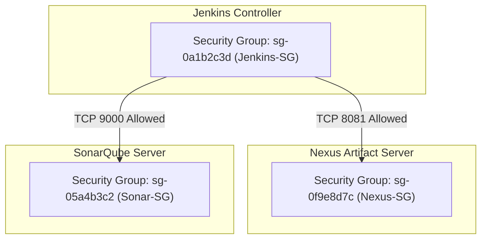

# 🛡️ AWS Security Groups & Network Firewall Design

An AWS Security Group operates as a **virtual stateful firewall** attached directly to an Elastic Network Interface (ENI) of an EC2 instance. It governs all network traffic entering and leaving the server.

---

## 🔄 1. Inbound vs Outbound Traffic

* **Inbound Rules:** Filter incoming network traffic trying to reach your EC2 instance from external clients, browsers, or other servers.
* **Outbound Rules:** Filter network traffic originating from your instance trying to reach outside servers (default AWS rule allows all outbound: `0.0.0.0/0`).
* **Stateful Behavior:** If you send a request out from an instance, the incoming response traffic for that request is allowed in automatically, regardless of inbound security group rules.

```text
                  INBOUND                                  OUTBOUND
Developer PC ─────────────> [ EC2 Port 8080 ] ─────────────> Maven Central (Dependencies)
Jenkins EC2  ─────────────> [ Nexus Port 8081 ]
Jenkins EC2  ─────────────> [ Sonar Port 9000 ]
```

---

## 🚫 2. The Danger of `0.0.0.0/0` (Wildcard Open Access)

Many online tutorials instruct students to set `0.0.0.0/0` (all IPv4 addresses worldwide) for every port to make setups "easy". 

> [!CAUTION]
> **Enterprise Risk:**
> Setting `0.0.0.0/0` on Port `22` (SSH) exposes your instance to global automated botnets executing brute-force attacks against SSH keys. Setting `0.0.0.0/0` on Port `8080` or `8081` exposes administrative consoles containing source code and build secrets to unauthorized web scanners.

### Safe Practices:
1. **Administrative Access (Port 22 SSH):** Select **My IP** in the AWS console dropdown (evaluates to `<Your-Public-IP>/32`).
2. **Web Consoles (8080, 8081, 9000):** Restrict to **My IP** or your corporate VPN CIDR block.

---

## 🔗 3. Security Group to Security Group (SG-to-SG) Rules

When Jenkins communicates with Nexus or SonarQube, do NOT open ports to the entire subnet or public IPs. Instead, reference the **Security Group ID** directly!

### Architecture Blueprint:


### Exact Rule Configurations:

#### 1. Nexus-SG Inbound Rules:
| Type | Port Range | Protocol | Source | Purpose |
|---|---|---|---|---|
| SSH | `22` | TCP | `My IP/32` | Sysadmin terminal management |
| Custom TCP | `8081` | TCP | `My IP/32` | Admin browser access to Nexus UI |
| Custom TCP | `8081` | TCP | **`sg-0a1b2c3d` (Jenkins-SG)** | Jenkins artifact upload authorization |

#### 2. Sonar-SG Inbound Rules:
| Type | Port Range | Protocol | Source | Purpose |
|---|---|---|---|---|
| SSH | `22` | TCP | `My IP/32` | Sysadmin terminal management |
| HTTP | `80` | TCP | `My IP/32` | Nginx reverse proxy access |
| Custom TCP | `9000` | TCP | `My IP/32` | Direct browser UI inspection |
| Custom TCP | `9000` | TCP | **`sg-0a1b2c3d` (Jenkins-SG)** | Jenkins Maven Sonar scanner payload |

#### 3. Jenkins-SG Inbound Rules:
| Type | Port Range | Protocol | Source | Purpose |
|---|---|---|---|---|
| SSH | `22` | TCP | `My IP/32` | Sysadmin terminal management |
| Custom TCP | `8080` | TCP | `My IP/32` | Jenkins UI web access |
| Custom TCP | `8080` | TCP | GitHub Webhook CIDR / Public IP | Automated push triggers |
| Custom TCP | `8080` | TCP | **`sg-05a4b3c2` (Sonar-SG)** | SonarQube Quality Gate webhook callback |
