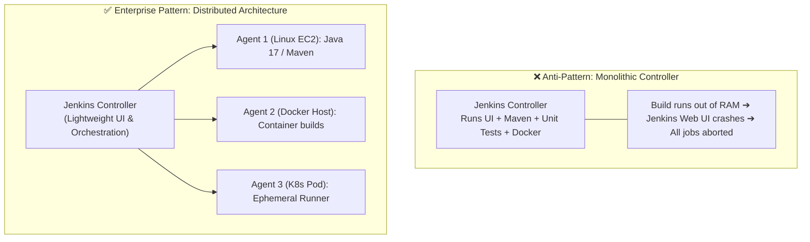

# 🤖 Jenkins Distributed Agents & Worker Nodes

In enterprise environments, running heavy compilation, test suites, and Docker builds directly on the Jenkins Controller server is considered a critical anti-pattern. Jenkins solves this through **Distributed Build Agents**.

---

## 🏛️ 1. Why Separate the Controller from Agents?



### Key Advantages:
1. **Controller Resilience:** If a build runs out of memory or hangs CPU at 100%, the Jenkins web UI remains responsive and accessible.
2. **Security Sandboxing:** Untrusted application code is executed on an isolated worker rather than where Jenkins credentials and master configuration reside.
3. **Multi-Platform Support:** Run Java pipelines on Linux agents and .NET pipelines on Windows agents from a single Jenkins controller.

---

## ⚙️ 2. Agent Syntax in Declarative Pipelines

```groovy
// 1. Any available online agent
pipeline {
    agent any
    // ...
}

// 2. Specific label-tagged agent (e.g. AWS EC2 with Docker)
pipeline {
    agent {
        label 'aws-linux-docker'
    }
    // ...
}

// 3. Ephemeral Docker Container Agent
pipeline {
    agent {
        docker {
            image 'maven:3.9-eclipse-temurin-17'
            args '-v /root/.m2:/root/.m2'
        }
    }
    stages {
        stage('Build') {
            steps {
                sh 'mvn clean package'
            }
        }
    }
}
```
