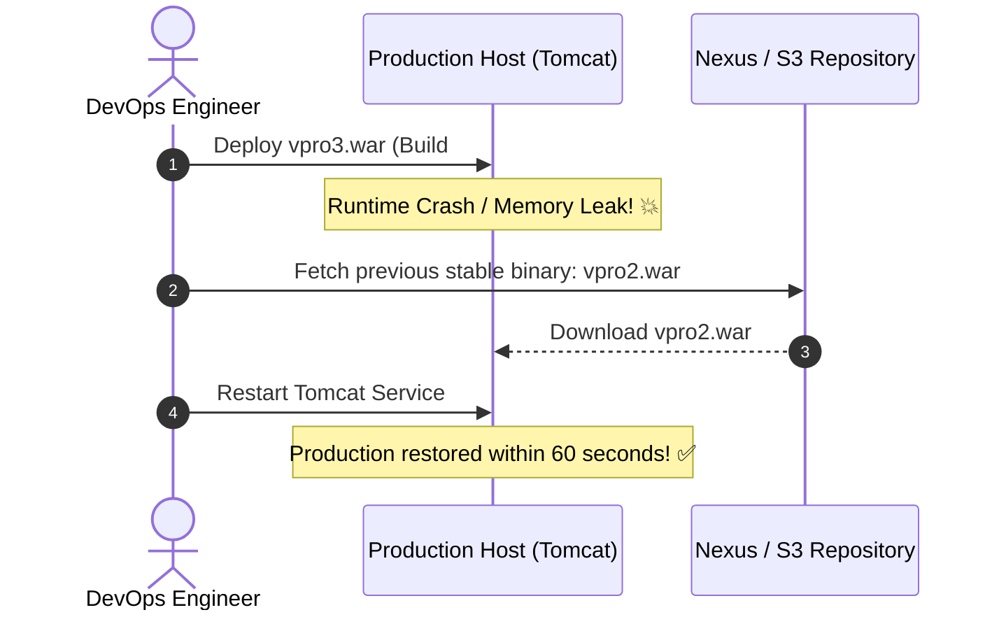

# 📦 Artifact Management, Versioning & Rollback Strategies

An **Artifact** is the final, pre-compiled, and deployable software deliverable produced by a build process (e.g. `vprofile-v2.war`, `.jar`, `.tar.gz`, or a Docker image).

---

## 🔍 1. Workspace vs Artifact vs Repository

| Entity | Primary Purpose | Lifecycle & Retention | Location |
|---|---|---|---|
| **Workspace** | Working directory for checking out code, compiling, and running tests. | **Ephemeral & Temporary:** Wiped clean across builds or when disk space runs low. | `/var/lib/jenkins/workspace/<job>/` |
| **Archived Artifact** | Build output saved directly in Jenkins for diagnostic download or promotion. | **Build Lifecycle:** Kept according to "Discard Old Builds" retention policy. | `/var/lib/jenkins/jobs/<job>/builds/<num>/archive/` |
| **Artifact Repository** | Enterprise storage for versioned, immutable production binary packages. | **Permanent & Immutable:** Versioned for years; consumed by deployment environments. | **Sonatype Nexus OSS / AWS S3** |

---

## 🏷️ 2. The Versioning Problem & Solution

### The Disaster of Static Naming:
When Apache Maven builds the VProfile project, it repeatedly outputs:
```text
target/vprofile-v2.war
```
If you do not version this file:
* **Build #1** produces `vprofile-v2.war`.
* **Build #2** overwrites `vprofile-v2.war`.
* If **Build #3** is deployed and crashes in production, **you cannot roll back** because earlier binaries were overwritten!

### The Automated Versioning Solution:
Inside the Jenkins build step or Jenkinsfile:
```bash
# 1. Ensure the versions directory exists
mkdir -p versions

# 2. Copy the binary with an automated, sequential build version tag
cp target/vprofile-v2.war versions/vpro$BUILD_NUMBER.war
```

```text
versions/
├── vpro1.war    (From Build #1)
├── vpro2.war    (From Build #2 - Stable)
└── vpro3.war    (From Build #3 - Buggy)
```

---

## 🔀 3. `$BUILD_NUMBER` vs `$VERSION` Parameter

| Metric | `$BUILD_NUMBER` | `$VERSION` Parameter |
|---|---|---|
| **Source** | Automatically incremented by Jenkins controller (`1`, `2`, `3`). | Provided dynamically by the engineer via `Build with Parameters`. |
| **Example** | `vpro42.war` | `vpro2.3.6.war` |
| **Best Use Case** | Internal CI tracking, development builds, QA promotion. | Formal production release versions following Semantic Versioning (`SemVer`). |

---

## ⚡ 4. Zero-Rebuild Rollback Mechanism

How versioned artifact repositories enable near-instantaneous production recovery:



> [!IMPORTANT]
> **Why Zero-Rebuild Matters:**
> Re-compiling an older Git commit during an active production outage introduces immense risk (build dependencies may have shifted, tests take 15 minutes to run, build agents might fail). By fetching the **pre-compiled, pre-tested stable binary (`vpro2.war`)**, downtime is minimized to seconds.
