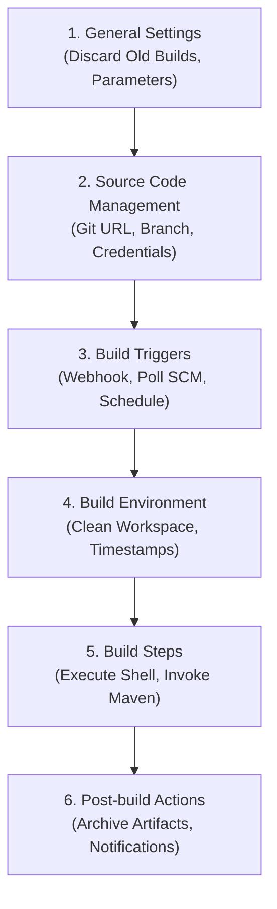

# 🎨 Jenkins Freestyle Projects

A Freestyle project is the traditional graphical job configuration model in Jenkins. It is configured entirely through the web user interface and serves as an excellent foundation for learning Jenkins mechanics.

---

## 🏗️ 1. The 6 Major Freestyle Configuration Sections

When creating a Freestyle project (**New Item ➔ Freestyle project**), you configure six sequential blocks:



---

## ⚙️ 2. Deep Dive into Configuration Sections

### 1. General Settings
* **Discard Old Builds:** Prevents disk exhaustion by capping the retention of historical builds.
  * *Days to keep builds:* `14`
  * *Max # of builds to keep:* `10`
* **This project is parameterized:** Allows users to inject dynamic inputs (e.g. `String Parameter` named `VERSION` with default `2.3.6`).

### 2. Source Code Management (SCM)
* **Repository URL:** `https://github.com/hkhcoder/vprofile-project.git` (or internal repository).
* **Credentials:** Select configured Jenkins credentials for private repositories.
* **Branch Specifier:** `*/atom` or `*/main`.

### 3. Build Triggers: How Builds Start
* **GitHub hook trigger for GITScm polling:** Recommended. Instant build trigger upon `git push`.
* **Poll SCM:** Checks Git on a schedule (e.g. `H/5 * * * *` = every 5 minutes). Slower and causes CPU overhead.
* **Build periodically:** Runs on a timer (e.g. `H 2 * * *` = nightly build at 2:00 AM) regardless of code changes.

### 4. Build Environment
* **Delete workspace before build starts:** Guarantees no stale build artifacts corrupt new builds.
* **Add timestamps to the Console Output:** Adds absolute timestamps to every logged stdout line.

### 5. Build Steps: The Actual Work
* **Invoke top-level Maven targets:**
  * *Maven Version:* `MAVEN3.9`
  * *Goals:* `clean install -DskipTests`
* **Execute shell:**
  ```bash
  whoami
  pwd
  uptime
  id

  # Artifact Versioning
  mkdir -p versions
  cp target/vprofile-v2.war versions/vpro$BUILD_NUMBER.war
  ```

### 6. Post-build Actions
* **Archive the artifacts:**
  * *Files to archive:* `**/*.war`, `versions/*.war`
  * Retains the deployable package directly in the Jenkins build UI.

---

## ⚖️ 3. Freestyle Projects vs Pipeline as Code

| Feature | Freestyle Projects | Pipeline as Code (Jenkinsfile) |
|---|---|---|
| **Configuration Interface** | 100% Web GUI form fields | Written in Groovy code (`Jenkinsfile`) |
| **Version Control** | Stored inside `/var/lib/jenkins/jobs/<job>/config.xml` (Hard to track) | Committed to Git alongside application code (`git log` visible) |
| **Complexity Handling** | Becomes difficult and unmaintainable for complex multi-branch pipelines | Excellent support for stages, parallel steps, loops, and conditions |
| **Reproducibility** | Difficult to duplicate to another Jenkins controller | Instantaneous (simply point Jenkins to the repository) |
| **Best Used For** | Quick experiments, simple scheduled jobs, learning Jenkins | **All enterprise CI/CD production pipelines** |
