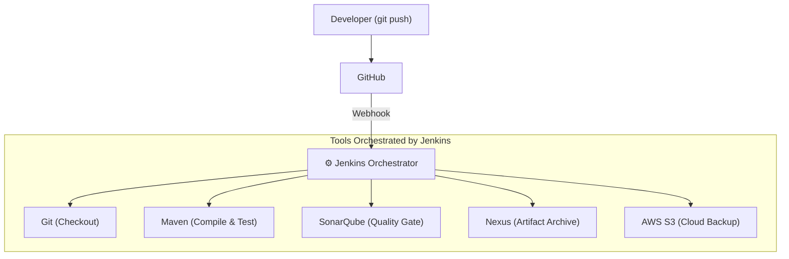
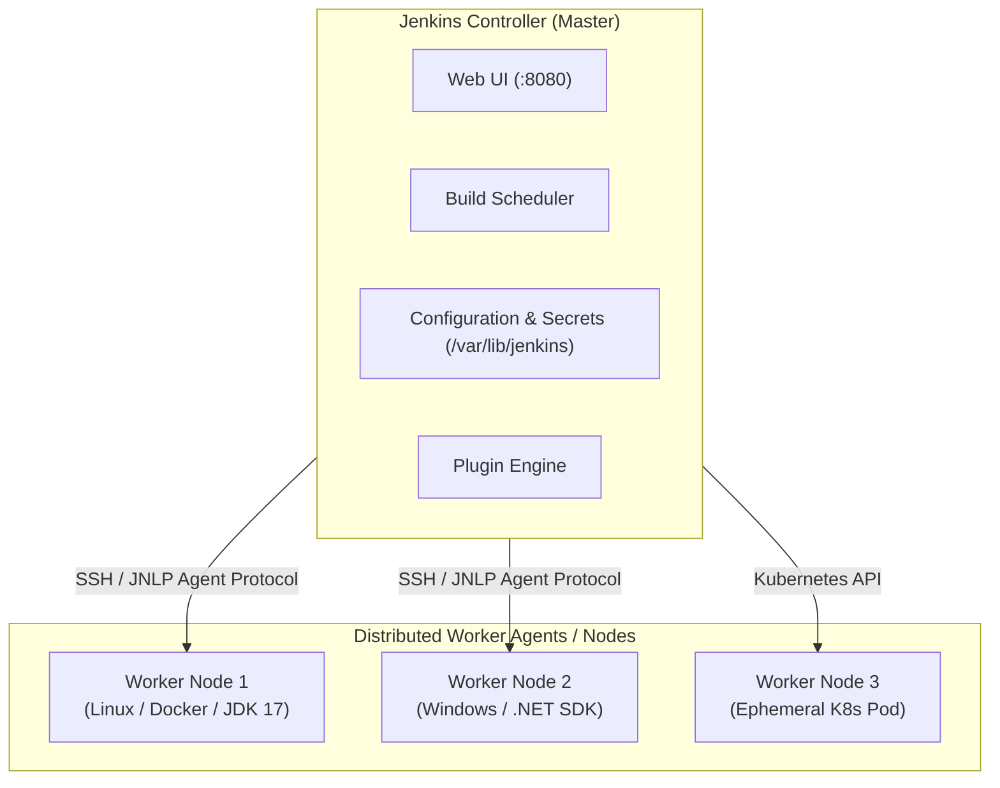

# 🏗️ Jenkins Architecture & Overview

Jenkins is the leading open-source automation server designed to orchestrate Continuous Integration and Continuous Delivery (CI/CD) pipelines.

---

## 🎯 1. What Jenkins Is (and What It Is Not)

> [!IMPORTANT]
> **Core Concept:**
> **Jenkins is an Orchestrator, not a compiler or artifact repository.**
> * Jenkins does not compile Java itself ➔ It tells **Apache Maven** to compile it.
> * Jenkins does not store source code ➔ It tells **Git** to clone it from **GitHub**.
> * Jenkins does not inspect code quality ➔ It invokes **SonarQube Scanner**.
> * Jenkins does not serve production packages ➔ It uploads binaries to **Nexus OSS** or **AWS S3**.



---

## 🏛️ 2. Controller vs Distributed Agent Architecture

Jenkins operates using a master-worker architecture:



### Roles:
* **Jenkins Controller:** Manages configurations, job schedules, monitors nodes, loads plugins, and renders the web interface.
* **Worker Agents (Nodes):** Dedicated machines or containers executing the actual heavy compilation and test workloads. This prevents build processes from consuming the controller's memory.

---

## 📂 3. Jenkins Filesystem Layout (`/var/lib/jenkins`)

In a standard Linux deployment, all Jenkins state resides in `/var/lib/jenkins`:

```text
/var/lib/jenkins/
├── config.xml                  -> Root global configuration settings
├── initialAdminPassword        -> In secrets/ during initial setup wizard
├── jobs/                       -> Directory containing all jobs and build histories
│   └── vprofile-pipeline/
│       ├── config.xml          -> Specific job definition
│       └── builds/
│           ├── 1/build.xml     -> Build #1 logs, timestamp, outcome
│           └── 2/build.xml
├── plugins/                    -> Downloaded .jpi and .hpi plugin binaries
├── secrets/                    -> Master cryptographic encryption keys
├── users/                      -> Local Jenkins user database accounts
└── workspace/                  -> Working directories where builds clone and execute
    └── vprofile-pipeline/
        ├── pom.xml
        ├── src/
        └── target/
```

> [!WARNING]
> **Operational Precaution:**
> Never manually delete or edit files directly inside `/var/lib/jenkins` while the Jenkins daemon is active. If you must back up Jenkins, archive `config.xml`, `jobs/`, `plugins/`, and `users/`.
