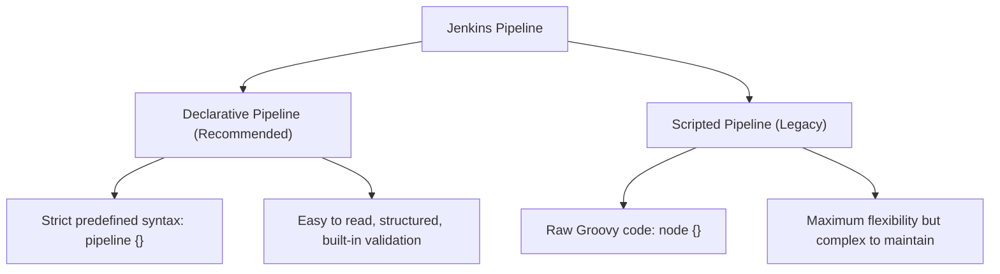

# 📜 Jenkins Pipeline as Code

Pipeline as Code treats the definition of the delivery pipeline with the same engineering rigor as application source code: versioned, peer-reviewed, and stored in Git.

---

## 🏗️ 1. Declarative vs Scripted Pipelines

Jenkins supports two syntax flavors:



### Direct Comparison:

```groovy
// DECLARATIVE (Standard):
pipeline {
    agent any
    stages {
        stage('Build') {
            steps {
                sh 'mvn clean compile'
            }
        }
    }
}

// SCRIPTED (Legacy Groovy):
node {
    stage('Build') {
        sh 'mvn clean compile'
    }
}
```

---

## ⚙️ 2. Pipeline Execution Models: Web UI vs SCM

When creating a Pipeline job (**New Item ➔ Pipeline**), Jenkins offers two ways to source the script:

1. **Pipeline script (Direct UI):**
   * The Groovy code is pasted directly into a text area in Jenkins.
   * Useful for quick debugging, but lacks version control.
2. **Pipeline script from SCM (Best Practice):**
   * You provide your Git repository URL and branch name.
   * Script Path points to `Jenkinsfile`.
   * Every commit to the repository automatically updates the pipeline logic!

---

## 🛡️ 3. The Groovy Sandbox & Script Approval

When pipelines run inside Jenkins, they execute within the **Groovy Sandbox** to prevent malicious scripts from executing arbitrary code on the controller JVM:

* **Use Groovy Sandbox (Checked):** Limits script execution to safe, standard Jenkins pipeline steps (`sh`, `git`, `archiveArtifacts`, `echo`).
* **Unapproved Script Execution:** If a pipeline invokes unauthorized Java reflection or internal methods (`System.exit()`, reading host files), Jenkins halts the build with:
  ```text
  Scripts not permitted to use method ... Administrators can decide whether to approve or reject this signature.
  ```
* **Approval Location:** Navigate to **Manage Jenkins ➔ In-process Script Approval** to manually review and approve methods.

> [!CAUTION]
> Never blindly approve unknown signatures or scripts submitted by untrusted repositories.
