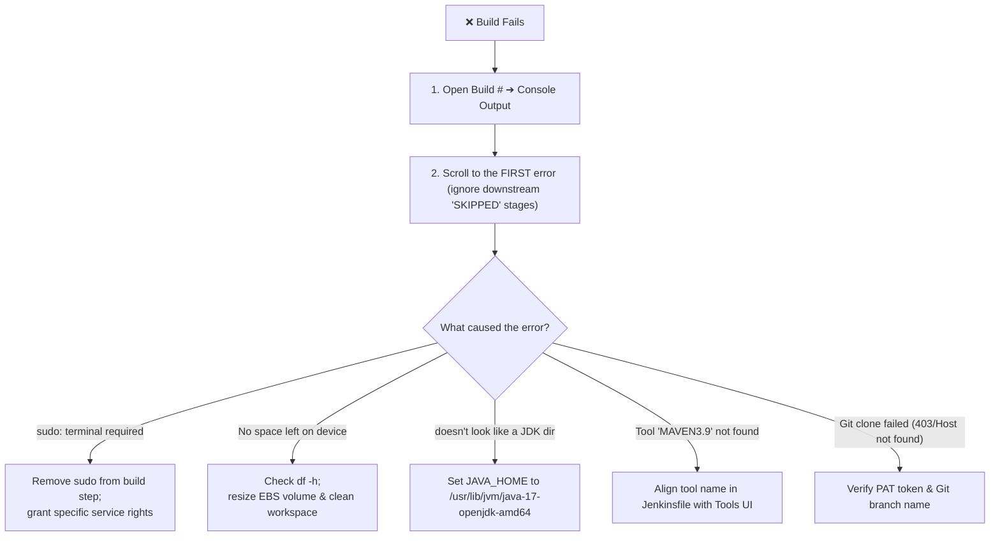

# 🩺 Jenkins Troubleshooting & Diagnostic Runbook

When a Jenkins pipeline fails, the primary rule of thumb is: **Always inspect Console Output and locate the FIRST meaningful error message.** Later failures or skipped steps are often just collateral damage.

---

## 🔍 1. The Gold Standard Debugging Workflow



---

## 🚨 2. Top 6 Jenkins Build Failures & Immediate Fixes

### 1. `sudo: a terminal is required to read the password`
* **Root Cause:** A build step invoked `sudo apt update` or a root command. Jenkins subshells are non-interactive and cannot accept passwords.
* **Fix:** Do not execute OS updates in CI builds. Pre-install dependencies or create a scoped rule in `/etc/sudoers.d/jenkins`.

### 2. `No space left on device`
* **Root Cause:** The 8 GiB root EBS volume ran out of space during Maven local repository downloads (`~/.m2/repository`).
* **Fix:**
  1. Inspect disk: `df -h`.
  2. Increase EBS volume to 20 GiB in AWS Console.
  3. Expand partition and filesystem: `sudo growpart /dev/xvda 1 && sudo resize2fs /dev/xvda1`.

### 3. `Tool 'MAVEN3.9' was not found in Jenkins Tools`
* **Root Cause:** A typo in the `Jenkinsfile`:
  ```groovy
  tools {
      maven "Maven-3.9"   // ❌ Mismatch!
  }
  ```
* **Fix:** Verify the exact string registered under `Manage Jenkins ➔ Tools ➔ Maven installations`. If named `MAVEN3.9`, the Jenkinsfile must match exactly: `maven "MAVEN3.9"`.

### 4. `JAVA_HOME: /usr/bin/java doesn't look like a JDK directory`
* **Root Cause:** Providing the path to the executable rather than the root directory.
* **Fix:** Set `JAVA_HOME` to `/usr/lib/jvm/java-17-openjdk-amd64`.

### 5. `Git checkout failed: fatal: Remote branch 'atom' not found`
* **Root Cause:** Specifying an incorrect or deleted branch name, or attempting to pull from a private repository without Jenkins credentials.
* **Fix:** Test the clone locally: `git ls-remote https://github.com/user/repo.git`. Attach the appropriate GitHub PAT credential.

### 6. Jenkins Web Page Not Opening (`HTTP :8080`)
* **Step 1:** Verify systemd daemon is active:
  ```bash
  sudo systemctl status jenkins
  ```
* **Step 2:** Verify Jenkins is listening on port 8080:
  ```bash
  sudo ss -lntp | grep 8080
  ```
* **Step 3:** Verify AWS Security Group allows inbound TCP 8080 from your current public IP (`curl ifconfig.me`).
