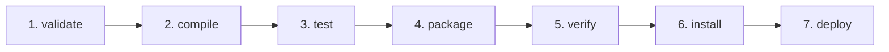

# ⚙️ Maven Build Lifecycles, Phases & Goals

Maven build lifecycles define a strict, orderly sequence of phases that must be executed to construct a software artifact.

---

## 🔄 1. The Three Built-in Maven Lifecycles

1. **`clean`:** Handles project cleaning and removing artifacts generated from prior builds.
   * *Phases:* `pre-clean` ➔ `clean` ➔ `post-clean`
2. **`default` (Build Lifecycle):** Handles project deployment preparation, compilation, testing, and packaging.
   * *Phases:* `validate` ➔ `compile` ➔ `test` ➔ `package` ➔ `verify` ➔ `install` ➔ `deploy`
3. **`site`:** Generates documentation and reports for the project.

---

## 📊 2. The Sequential Phases of the Default Lifecycle

When you request a phase (e.g. `mvn package`), Maven executes **every preceding phase** in strict order:



| Phase | What Happens Under the Hood |
|---|---|
| **`validate`** | Validates the project structure and verifies all mandatory pom.xml info is available. |
| **`compile`** | Compiles `.java` source code into `.class` bytecode in `target/classes`. |
| **`test`** | Compiles test sources and runs automated tests using Surefire. If a test fails, the build halts. |
| **`package`** | Takes compiled code and packages it into configured format (`target/vprofile-v2.war`). |
| **`verify`** | Runs checks on integration test results to ensure quality criteria are met. |
| **`install`** | Installs the packaged artifact into the local repository (`~/.m2/repository/`) for use as a dependency in other local projects. |
| **`deploy`** | Copies the final package to the remote enterprise repository (Nexus / Artifactory). |

---

## ⚡ 3. The `-DskipTests` Flag in CI Pipelines

In our production Jenkinsfile:
```groovy
stage('Unit Test') {
    steps {
        sh 'mvn test'
    }
}

stage('Build') {
    steps {
        sh 'mvn install -DskipTests'
    }
}
```

### Why `-DskipTests`?
* Running `mvn test` in its own stage provides dedicated test logging and clear stage failures if business logic breaks.
* If the subsequent build stage ran plain `mvn install`, Maven's default lifecycle would re-run every unit test from scratch, doubling execution time.
* `-DskipTests` tells Maven: *"Proceed with compilation and packaging, but skip test execution."*
