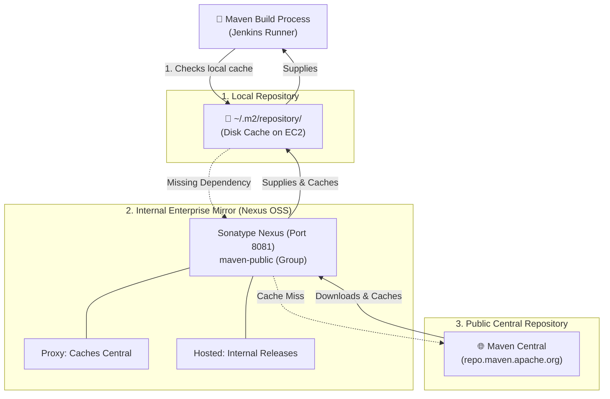

# 📦 Maven Repositories: Local, Central & Nexus

Maven repositories are directories of packaged JAR libraries with metadata detailing transitive dependencies.

---

## 🏛️ 1. The Three Repository Tiers



---

## 📂 2. Tier Details

### 1. Local Repository (`~/.m2/repository/`):
* Resides locally on the host machine running Maven (for Jenkins, `/var/lib/jenkins/.m2/repository/`).
* Stores all downloaded third-party dependencies and artifacts installed via `mvn install`.

### 2. Central Repository:
* The official public repository provided by the Maven community containing millions of open-source libraries.

### 3. Remote Internal Repository (Sonatype Nexus OSS):
* An internal artifact manager serving as a proxy cache for external dependencies and a secure store for proprietary corporate binaries.

---

## ⚙️ 3. Configuring Maven to Use Nexus via `settings.xml`

File: `/var/lib/jenkins/.m2/settings.xml`

```xml
<settings>
  <mirrors>
    <mirror>
      <id>nexus-internal</id>
      <name>Internal Nexus Mirror</name>
      <url>http://172.31.20.12:8081/repository/maven-public/</url>
      <mirrorOf>*</mirrorOf>
    </mirror>
  </mirrors>

  <servers>
    <server>
      <id>nexus-internal</id>
      <username>admin</username>
      <password>AdminSecret123!</password>
    </server>
  </servers>
</settings>
```
