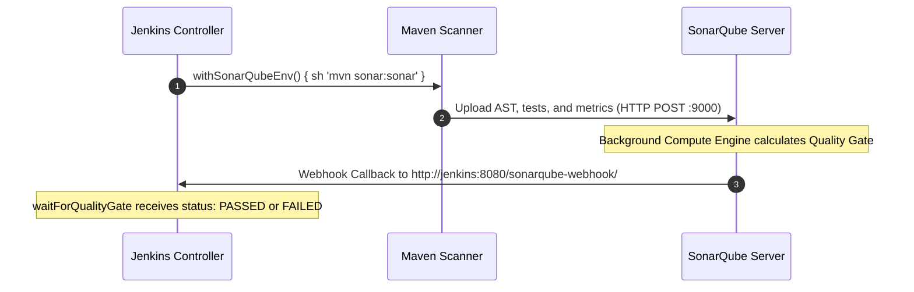

# 🔗 Jenkins & SonarQube End-to-End Integration

Integrating Jenkins with SonarQube requires configuring two-way communication: Jenkins initiates scans to SonarQube, and SonarQube sends Quality Gate webhook responses back to Jenkins.

---

## 🔄 1. The Two-Way Communication Architecture



---

## 🛠️ 2. Configuration Steps in Jenkins

### Step 1: Install Plugin
Navigate to **Manage Jenkins ➔ Plugins ➔ Available plugins** ➔ Install **SonarQube Scanner for Jenkins**.

### Step 2: Store SonarQube Authentication Token
1. In SonarQube Web UI: Go to **My Account ➔ Security ➔ Generate Tokens** (Type: *Global Analysis Token*). Copy the token string.
2. In Jenkins: Go to **Manage Jenkins ➔ Credentials ➔ Global ➔ Add Credentials**:
   * *Kind:* **Secret text**
   * *Secret:* `<Paste Sonar Token>`
   * *ID:* `sonarqube-api-token`

### Step 3: Register SonarQube Server in Jenkins System Settings
Go to **Manage Jenkins ➔ System ➔ SonarQube servers**:
* **Name:** `SonarQube-Server` (Used in Jenkinsfile)
* **Server URL:** `http://172.31.20.11:9000` (Use private IP if in same AWS VPC)
* **Server authentication token:** Select `sonarqube-api-token`
* Check *Enable injection of SonarQube server configuration as build environment variables*.

---

## 🪝 3. Configuring the Webhook in SonarQube (Crucial!)

Without a webhook, `waitForQualityGate` in your pipeline will hang and time out because SonarQube will never notify Jenkins when computation finishes!

1. Open SonarQube in browser.
2. Navigate to: **Administration ➔ Configuration ➔ Webhooks ➔ Create**.
3. **Name:** `Jenkins-Pipeline-Webhook`
4. **URL:**
   ```text
   http://<JENKINS_PRIVATE_IP>:8080/sonarqube-webhook/
   ```
5. Click **Create**.

---

## 💻 4. Pipeline Script Implementation

```groovy
stage('SonarQube Code Analysis') {
    steps {
        withSonarQubeEnv('SonarQube-Server') {
            sh 'mvn sonar:sonar'
        }
    }
}

stage('Enforce Quality Gate') {
    steps {
        timeout(time: 5, unit: 'MINUTES') {
            waitForQualityGate abortPipeline: true
        }
    }
}
```
