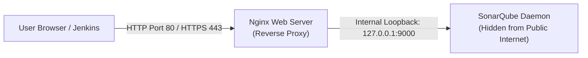

# 🌐 Nginx Reverse Proxy Setup for SonarQube

In enterprise production environments, internal application services running on custom high-order ports (such as SonarQube on port `9000`) are fronted by a reverse proxy like **Nginx** listening on standard HTTP (`80`) or HTTPS (`443`).

---

## 🏛️ 1. Why Front SonarQube with Nginx?



### Architectural Benefits:
1. **Port Simplification:** Users connect via standard HTTP port `80` (or `443` with SSL) instead of remembering `:9000`.
2. **TLS / HTTPS Termination:** Nginx can terminate SSL certificates (e.g. Let's Encrypt or corporate certificates) without complex Java keystore configurations inside SonarQube.
3. **Security Shielding:** SonarQube's direct port can be bound strictly to `127.0.0.1`, completely blocking external network scans.
4. **Header Rewriting & Buffering:** Nginx efficiently handles large client buffer headers.

---

## ⚙️ 2. Production Nginx Configuration File

File: `/etc/nginx/sites-available/sonarqube`

```nginx
server {
    listen 80;
    server_name sonarqube.groophy.in;

    access_log /var/log/nginx/sonar.access.log;
    error_log /var/log/nginx/sonar.error.log;

    proxy_buffers 16 64k;
    proxy_buffer_size 128k;

    location / {
        proxy_pass http://127.0.0.1:9000;
        proxy_next_upstream error timeout invalid_header http_500 http_502 http_503 http_504;
        proxy_redirect off;

        proxy_set_header Host $host;
        proxy_set_header X-Real-IP $remote_addr;
        proxy_set_header X-Forwarded-For $proxy_add_x_forwarded_for;
        proxy_set_header X-Forwarded-Proto http;
    }
}
```

---

## 🚀 3. Deployment Commands

```bash
# 1. Install Nginx
sudo apt update && sudo apt install nginx -y

# 2. Remove default Apache/Nginx greeting page
sudo rm -rf /etc/nginx/sites-enabled/default
sudo rm -rf /etc/nginx/sites-available/default

# 3. Create the symlink enabling the site
sudo ln -s /etc/nginx/sites-available/sonarqube /etc/nginx/sites-enabled/sonarqube

# 4. Test syntax configuration
sudo nginx -t

# 5. Enable and start Nginx service
sudo systemctl enable nginx
sudo systemctl restart nginx
```
