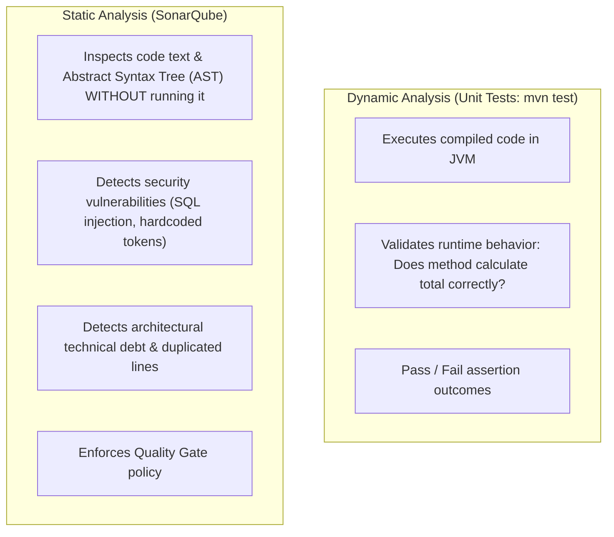
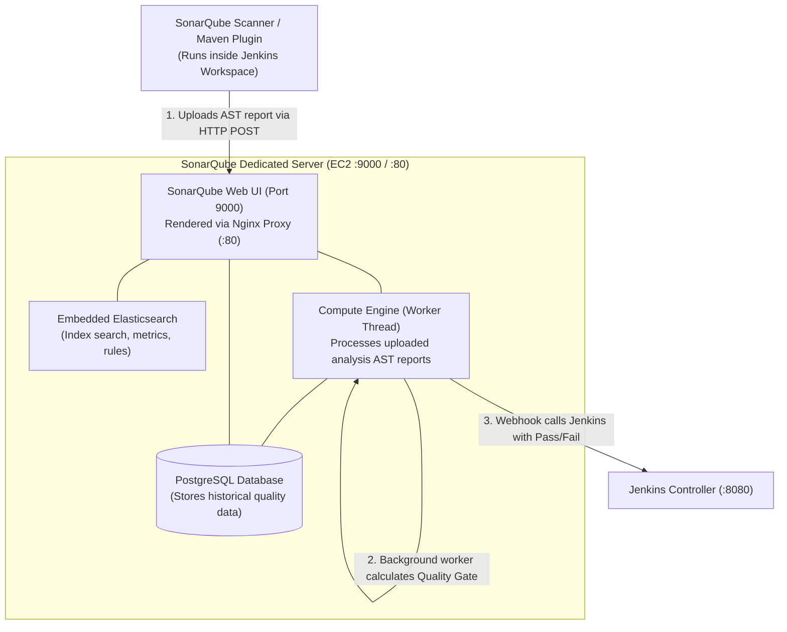

# 🔍 SonarQube Code Quality & Static Analysis Overview

SonarQube is the industry-standard platform for Continuous Code Inspection, performing automatic static code analysis to detect bugs, code smells, and security vulnerabilities across 30+ programming languages.

---

## 🎯 1. Static Analysis vs Dynamic Unit Testing

---

## 🔬 2. The Four Pillars of SonarQube Inspection

1. **Bugs:** Coding flaws that will likely cause crashes, memory leaks, or erratic runtime failures (e.g. NullPointerExceptions, unclosed I/O streams).
2. **Vulnerabilities:** Security flaws exposed to attackers (e.g. SQL Injection vulnerabilities, cross-site scripting [XSS], insecure cryptographic algorithms).
3. **Security Hotspots:** Sensitive pieces of code that require human architectural review (e.g. CSRF token validation, cookie configuration).
4. **Code Smells (Maintainability):** Sloppy, convoluted code that increases technical debt, making maintenance painful (e.g. dead code, duplicated blocks, functions with 15 arguments).

---

## ⚖️ 3. The SonarQube Architecture

