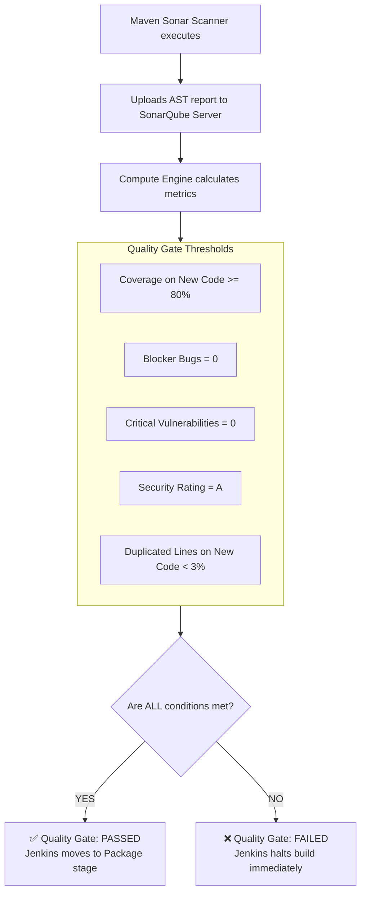

# 🛡️ SonarQube Quality Gates & Policy Enforcement

A **Quality Gate** is the ultimate checkpoint determining whether analyzed source code meets minimum operational and architectural standards before proceeding to packaging and release.

---

## 🎯 1. How a Quality Gate Works



---

## 🧹 2. "Clean as You Code" Methodology

Older legacy codebases often have thousands of pre-existing bugs and zero unit tests. Forcing an engineering team to fix 50,000 legacy bugs before deploying any minor update causes development paralysis.

SonarQube solves this with **Clean as You Code**:
* **New Code Period:** The Quality Gate focuses strictly on **new or modified lines of code** introduced in the current Git branch or pull request.
* As long as all *newly written code* has zero bugs and 80%+ test coverage, the Quality Gate passes! Over time, the overall codebase naturally cleans itself.

---

## 🛑 3. Why Jenkins Must Halt on Quality Gate Failure

If a pipeline does not enforce the Quality Gate:
* Vulnerable code is compiled into binaries.
* Nexus stores a defective package.
* Staging or production environments deploy broken software.

In Jenkins Declarative Pipeline:
```groovy
stage('Quality Gate') {
    steps {
        timeout(time: 5, unit: 'MINUTES') {
            // Halts build immediately if SonarQube returns FAILED:
            waitForQualityGate abortPipeline: true
        }
    }
}
```
