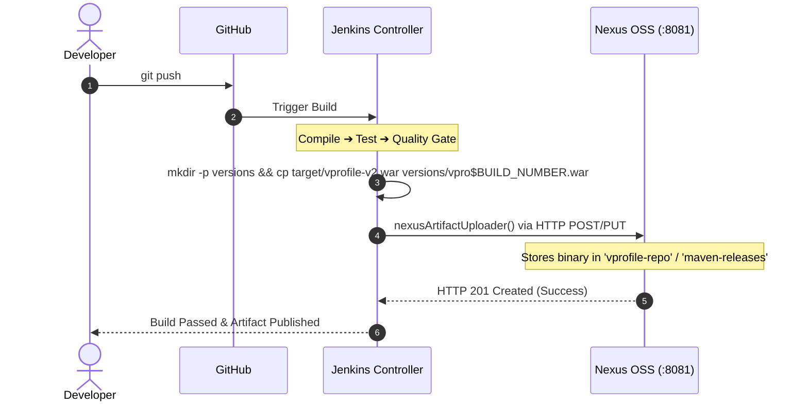

# 🔗 Jenkins & Nexus End-to-End Integration

This guide details how Jenkins authenticates with Sonatype Nexus to upload packaged, versioned Java artifacts (`.war`) automatically upon successful build and test completion.

---

## 🏗️ 1. Integration Workflow Architecture



---

## ⚙️ 2. Step-by-Step Configuration

### Step 1: Install the Nexus Plugin in Jenkins
Navigate to **Manage Jenkins ➔ Plugins ➔ Available plugins** ➔ Install **Nexus Artifact Uploader**.

### Step 2: Store Nexus Credentials in Jenkins
1. Navigate to **Manage Jenkins ➔ Credentials ➔ Global ➔ Add Credentials**.
2. **Kind:** `Username with password`
3. **Username:** `admin` (or dedicated CI service user `jenkins-deployer`)
4. **Password:** `<Your Nexus Password>`
5. **ID:** `nexus-login-creds`
6. Click **Create**.

### Step 3: Create Hosted Repository in Nexus
1. In Nexus UI: Click the **Gear icon (Administration) ➔ Repository ➔ Repositories ➔ Create repository**.
2. Select **`maven2 (hosted)`**.
3. **Name:** `vprofile-repo`
4. **Version policy:** `Mixed` or `Release`.
5. **Deployment policy:** `Allow redeploy` (for development) or `Disable redeploy` (for strict production).
6. Click **Create repository**.

---

## 💻 3. Declarative Pipeline Implementation

```groovy
stage('Upload to Nexus Repository') {
    steps {
        nexusArtifactUploader(
            nexusVersion: 'nexus3',
            protocol: 'http',
            nexusUrl: '172.31.20.12:8081',
            groupId: 'com.visualpathit',
            version: "${BUILD_NUMBER}",
            repository: 'vprofile-repo',
            credentialsId: 'nexus-login-creds',
            artifacts: [
                [
                    artifactId: 'vprofile-app',
                    classifier: '',
                    file: "versions/vpro${BUILD_NUMBER}.war",
                    type: 'war'
                ]
            ]
        )
    }
}
```

### Parameter Breakdown:
* **`nexusVersion`:** Must specify `'nexus3'`.
* **`nexusUrl`:** The IP and port of the Nexus EC2 server (omit `http://` prefix in this specific parameter).
* **`groupId`:** Matches Maven project coordinate (`com.visualpathit`).
* **`version`:** Dynamic version string (`${BUILD_NUMBER}` evaluates to `1`, `2`, `3`).
* **`file`:** The exact filesystem path to the packaged binary inside the Jenkins workspace.
