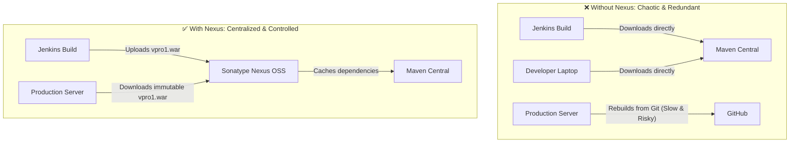

# 📦 Sonatype Nexus OSS Overview & Architecture

Sonatype Nexus Repository Manager OSS is the world's most widely adopted artifact repository, designed to proxy, store, and manage software packages, dependencies, and deployment binaries throughout their lifecycle.

---

## 🎯 1. Why Do We Need Nexus?

In an enterprise without an artifact repository:
* Developers and CI runners repeatedly download hundreds of megabytes of identical dependencies from Maven Central, saturating external internet bandwidth.
* Build binaries remain trapped on individual developer laptops or inside ephemeral Jenkins workspaces.
* Deployments require re-compiling source code from Git, introducing risks of non-deterministic builds.

### Core Value Propositions:
1. **Dependency Proxy & Caching:** Caches public dependencies locally, dramatically speeding up subsequent build execution.
2. **Central Single Source of Truth for Binaries:** Stores deployable application packages (`.war`, `.jar`, Docker images, npm packages).
3. **Immutability & Auditability:** Release repositories can enforce read-only policies once a version is published, guaranteeing release integrity.
