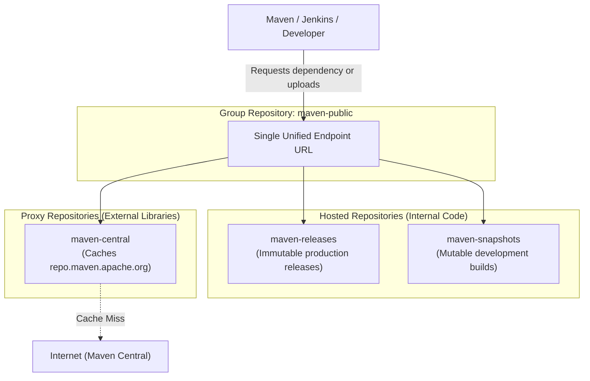

# 📚 Nexus Repository Types: Hosted, Proxy & Group

Understanding Nexus repository architecture is essential for properly organizing enterprise build artifacts and dependency caching.

---

## 🏛️ 1. The Three Repository Types Explained

---

## 🔍 2. Deep Dive into Each Type

### 1. Hosted Repository (Internal Artifacts)
* **Definition:** A repository physically stored and managed on your local Nexus server.
* **Purpose:** Stores software created by your engineering teams.
* **Key Variants:**
  * **`maven-releases`:** Strict write-once policy. Artifact versions (e.g. `2.3.0`) **cannot be overwritten** once uploaded. Guarantees immutability.
  * **`maven-snapshots`:** Allows repeated uploads to the same version (e.g. `2.4.0-SNAPSHOT`) for ongoing daily development builds.

### 2. Proxy Repository (External Dependencies)
* **Definition:** A repository linked to a remote public repository (such as Maven Central or npmjs.org).
* **Purpose:** When a developer or CI job requests a dependency (e.g. Spring Framework), Nexus checks its local cache:
  * *If cached:* Serves it immediately over local LAN bandwidth.
  * *If not cached:* Fetches it from the public internet, caches a copy on disk, and serves it to the requester.

### 3. Group Repository (Unified Aggregate)
* **Definition:** A single combined URL that aggregates multiple hosted and proxy repositories into one endpoint (e.g. `maven-public`).
* **Purpose:** Developers only configure **one single repository URL** in their Maven `settings.xml`. Nexus automatically handles routing between releases, snapshots, and proxied open-source libraries.
