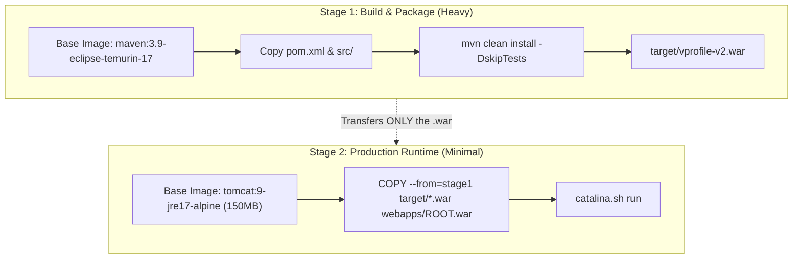

# 📝 Dockerfile Architecture & Multi-Stage Builds

A `Dockerfile` is a text blueprint describing instructions to construct an immutable container image.

---

## 🏗️ 1. Multi-Stage Build Architecture (Best Practice)

In traditional Dockerfiles, Maven, JDK, Git, and build tools remain inside the final production container image, inflating image size from 150 MB to 1.5 GB and introducing vast CVE vulnerability surfaces.

**Multi-Stage Builds** solve this by separating the **Build Environment** from the **Runtime Environment**:



---

## 📄 2. Production Multi-Stage Dockerfile for VProfile

```dockerfile
# ==========================================
# Stage 1: Build Environment
# ==========================================
FROM maven:3.9-eclipse-temurin-17 AS builder

WORKDIR /app

# Optimize build caching: copy pom.xml first to cache dependencies
COPY pom.xml .
RUN mvn dependency:go-offline -B

# Copy application source code and compile
COPY src ./src
RUN mvn clean package -DskipTests

# ==========================================
# Stage 2: Runtime Production Environment
# ==========================================
FROM tomcat:9.0-jre17-temurin

LABEL maintainer="devops@groophy.in"

# Clean out default Tomcat sample applications
RUN rm -rf /usr/local/tomcat/webapps/*

# Copy packaged WAR binary from Stage 1 into Tomcat webapps
COPY --from=builder /app/target/vprofile-v2.war /usr/local/tomcat/webapps/ROOT.war

EXPOSE 8080

CMD ["catalina.sh", "run"]
```

---

## ⚡ 3. Key Directives Reference

* **`FROM`:** Initializes a new build stage and sets the Base Image.
* **`WORKDIR`:** Sets the working directory for subsequent instructions.
* **`COPY`:** Copies files/directories from the host build context into the image.
* **`RUN`:** Executes shell commands during image build time (creates a new image layer).
* **`EXPOSE`:** Documents the network port the container listens on at runtime.
* **`CMD`:** The default command executed when a container is launched.
