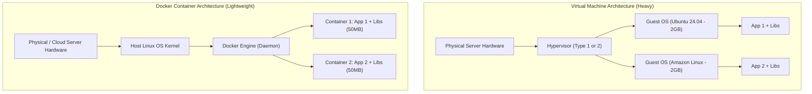

# 🐳 Docker & Containerization Overview

Docker is an open-source platform that enables developers and operations engineers to package applications and their dependencies into lightweight, standalone executable units known as **Containers**.

---

## 🏛️ 1. Virtual Machines vs Docker Containers

| Feature | Virtual Machines (VMs) | Docker Containers |
|---|---|---|
| **Operating System** | Each VM bundles a full, separate Guest OS | Shares the underlying Host OS Linux kernel |
| **Startup Time** | Minutes (boots full OS kernel) | Milliseconds to seconds (process instantiation) |
| **Resource Footprint** | Gigabytes of RAM and disk per instance | Megabytes of RAM and disk |
| **Portability** | Hypervisor dependent (.vmdk, AMI) | 100% standard across any machine with Docker Engine |

---

## ⚙️ 2. Core Docker Concepts

1. **Dockerfile:** A text document containing instructions to assemble an immutable container image.
2. **Docker Image:** A read-only, multi-layered template containing runtime binaries, libraries, and application code.
3. **Docker Container:** A running, isolated instance of an image with a thin read-write top layer.
4. **Docker Registry:** A repository for storing and distributing images (e.g. Docker Hub, Amazon ECR, Nexus Docker Registry).
