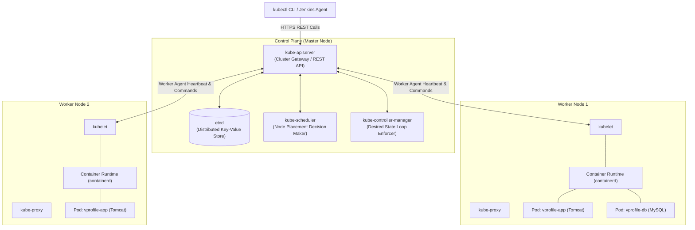

# 🏛️ Kubernetes Cluster Architecture

A Kubernetes cluster follows a master-worker architecture consisting of a **Control Plane** (master) and one or more **Worker Nodes**.

---

## 🗺️ 1. Master & Worker Topology Diagram

---

## ⚙️ 2. Control Plane Components

* **`kube-apiserver`:** The front-end of the Control Plane. Exposes the Kubernetes API; all internal components and external `kubectl` commands communicate strictly through it.
* **`etcd`:** Consistent, highly-available key-value store used as Kubernetes' backing store for all cluster data (state, secrets, configs).
* **`kube-scheduler`:** Watches for newly created Pods with no assigned node and selects the best node for them to run on based on CPU/memory resource availability.
* **`kube-controller-manager`:** Runs controller processes in a continuous reconciliation loop:
  * *Node Controller:* Detects when nodes go offline.
  * *Replication Controller:* Ensures correct replica counts.
  * *Endpoints Controller:* Populates Endpoints objects (joining Services & Pods).

---

## 🏃 3. Worker Node Components

* **`kubelet`:** An agent that runs on each node in the cluster. It ensures that containers are running in a Pod according to the PodSpec.
* **`kube-proxy`:** Network proxy that maintains network rules on nodes, enabling communication to Pods from inside or outside the cluster.
* **Container Runtime:** The software responsible for running containers (e.g. `containerd`, `CRI-O`).
