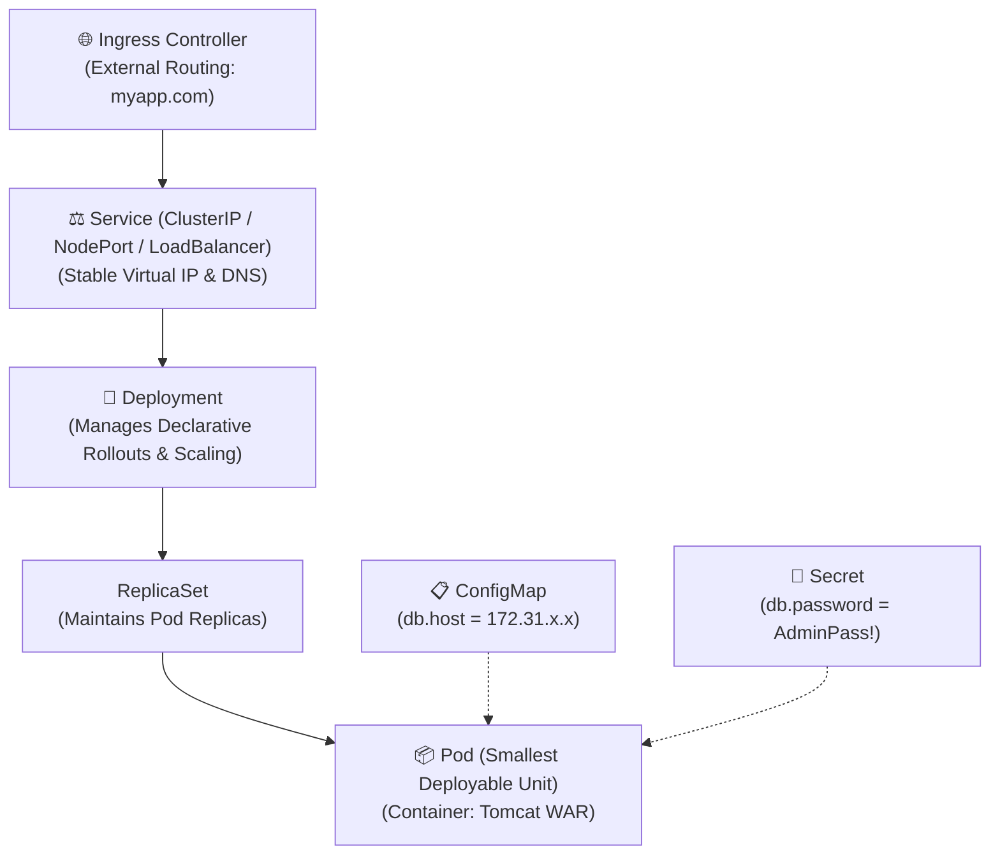

# 🧱 Kubernetes Core Objects & Workloads

In Kubernetes, you manage infrastructure declaratively by defining desired states in YAML configuration manifests.

---

## 📦 1. Core Object Hierarchy



---

## 📄 2. Practical Manifest: VProfile Deployment & Service

```yaml
# ==========================================
# 1. Deployment Specification
# ==========================================
apiVersion: apps/v1
kind: Deployment
metadata:
  name: vprofile-deployment
  labels:
    app: vprofile-app
spec:
  replicas: 3
  selector:
    matchLabels:
      app: vprofile-app
  template:
    metadata:
      labels:
        app: vprofile-app
    spec:
      containers:
      - name: vprofile-tomcat
        image: myregistry.azurecr.io/vprofile-app:1.0
        ports:
        - containerPort: 8080
        resources:
          limits:
            memory: "1Gi"
            cpu: "500m"
          requests:
            memory: "512Mi"
            cpu: "250m"

---
# ==========================================
# 2. Service Specification (Load Balancer)
# ==========================================
apiVersion: v1
kind: Service
metadata:
  name: vprofile-service
spec:
  type: LoadBalancer
  selector:
    app: vprofile-app
  ports:
  - port: 80
    targetPort: 8080
```

---

## ⌨️ 3. Essential `kubectl` CLI Commands

```bash
# Apply a declarative manifest
kubectl apply -f vprofile-k8s.yaml

# List active Pods, Deployments, and Services
kubectl get pods -o wide
kubectl get deployments
kubectl get svc

# Scale deployment replicas on the fly
kubectl scale deployment/vprofile-deployment --replicas=5

# Inspect detailed events and health status
kubectl describe pod <pod-name>

# View live container logs
kubectl logs -f <pod-name>

# Execute interactive shell inside a container pod
kubectl exec -it <pod-name> -- /bin/bash
```
