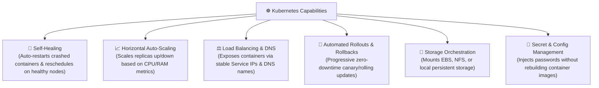

# ☸️ Kubernetes (K8s) Overview & Value Proposition

Kubernetes (often abbreviated as **K8s**) is an open-source container orchestration system for automating software deployment, scaling, load balancing, and container management.

---

## 🎯 1. Why Do We Need Kubernetes?

While Docker allows you to run containers on a single host, running distributed containers in high-scale production creates major operational challenges:
* **Host Failures:** What happens if the physical server hosting your container crashes at 3:00 AM?
* **Auto-Scaling:** How do you automatically spin up 20 additional container replicas during Black Friday traffic surges?
* **Zero-Downtime Rollouts:** How do you roll out a new software version across 100 containers without downtime?
* **Service Discovery & Load Balancing:** How do frontend microservices discover the dynamic IP addresses of backend API containers?

Kubernetes was built by Google to solve these exact problems.

---

## 🏛️ 2. Core Capabilities of Kubernetes

