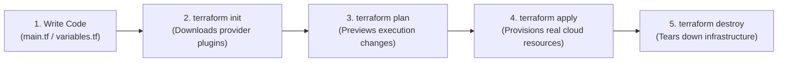

# 🌍 HashiCorp Terraform Overview & IaC Philosophy

Terraform is an open-source **Infrastructure as Code (IaC)** tool created by HashiCorp. It allows engineers to define, provision, and configure cloud infrastructure using a declarative configuration language known as **HashiCorp Configuration Language (HCL)**.

---

## 🏛️ 1. Why Infrastructure as Code (IaC)?

Before IaC, provisioning servers, VPCs, subnets, and databases required clicking manually through web consoles (**ClickOps**):
* **Error Prone:** A sysadmin forgets one Security Group rule or chooses the wrong subnet CIDR.
* **Slow:** Re-creating a staging environment takes days of manual configuration.
* **No Version History:** You cannot run `git diff` to see who modified an AWS firewall rule.

### With Terraform:
* Infrastructure is defined in code (`main.tf`).
* Changes are reviewed via Pull Requests before being applied.
* Complete multi-tier AWS environments can be provisioned in minutes.
* Environments can be destroyed cleanly with a single command (`terraform destroy`).

---

## 🔄 2. The Core Terraform Workflow

