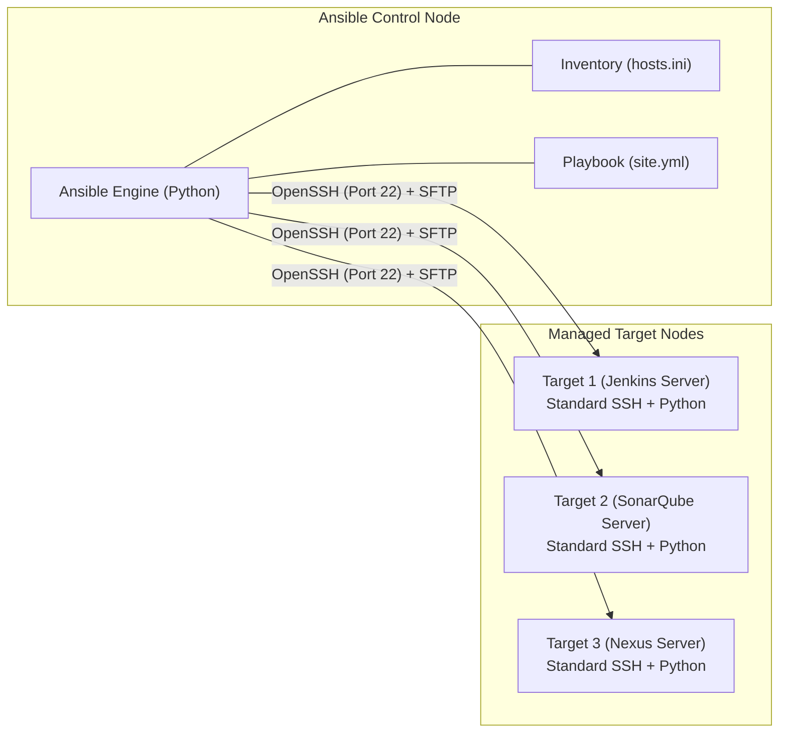

# 📜 Ansible & Configuration Management Overview

Ansible is an open-source IT automation engine that automates cloud provisioning, configuration management, application deployment, and intra-service orchestration.

---

## 🏛️ 1. Why Ansible? (Agentless Architecture)

Unlike legacy tools like Puppet or Chef which require installing, running, and updating background agent daemons on every managed target node, **Ansible is 100% Agentless**.

### Key Advantages:
1. **Zero Client Footprint:** Target servers only need a standard SSH server and Python runtime.
2. **Idempotency:** A core Ansible principle—running a playbook 10 times produces the exact same state as running it once without causing unintended side effects.
3. **Human-Readable YAML:** Playbooks are written in simple YAML syntax.
